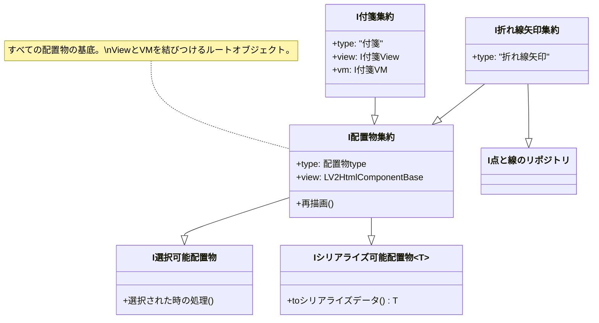
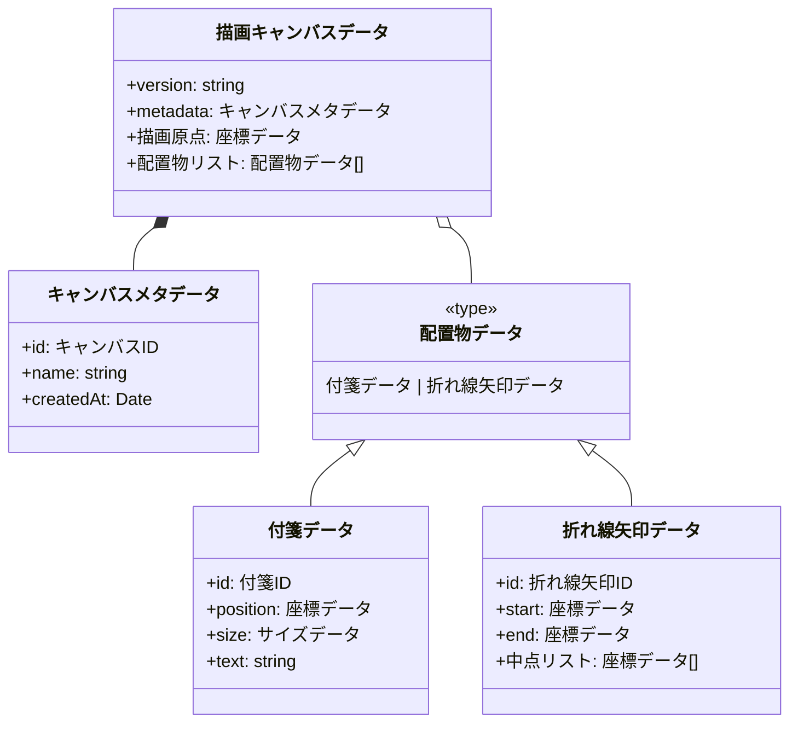

# 基本オブジェクト構造

> [!abstract] 概要
> BoomYackのグラフ要素（ノード、エッジ）を表現するための基本インターフェースおよびデータ構造の定義です。
> `I配置物.ts` および `データクラス.ts` に実装されています。

## 配置物インターフェース (Interfaces)
配置物は「集約 (Aggregate)」として定義され、View（描画）とVM（データ・ロジック）を保持します。

### 主要インターフェース解説
- **I配置物集約**: すべてのグラフ要素が実装すべき基底インターフェース。Viewへの参照を持ち、再描画のトリガーとなります。
- **I点と線のリポジトリ**: 折れ線矢印など、複雑な形状制御が必要な要素が実装します。中点（ハンドル）の追加・削除を管理します。
- **Iシリアライズ可能配置物<T>**: 永続化のためのデータ変換インターフェース。ジェネリクスを使用することで、シリアライズされるデータの構造を静的に定義し、型安全性を確保しています。

---

## データモデル (Data Models)
永続化（保存・読み込み）に使用されるイミュータブルなデータクラス群です。
**Defensive OOP** パターンを採用し、不正な状態を防いでいます。

> [!info] 実装ポイント
> - **Immutable**: 基本的にプロパティは `readonly` であり、変更時は `withXxx()` メソッドで新しいインスタンスを生成します。
> - **Serialization**: `toJSON()` と `static fromJSON()` を持ち、JSONとの相互変換を安全に行います。

## ユーザーインターフェース構成 (UI Components)
グラフ操作を支える主要なUIコンポーネントです。

- **多段格子コンテキストメニュー**: 
    - `CanvasView` および `付箋View` で右クリック時に表示される司令塔。
    - CSS Gridベースの 7x7 グリッド構造を持ち、1層目のクイックアクション（十字）とカテゴリ（斜め）、および2層目の詳細メニューを提供します。
    - `string[]` による柔軟な改行制御と、アイコン・透過デザインを統合。

## 関連ファイル
- `src/BoomYack/基本オブジェクト/I配置物.ts`
- `src/BoomYack/基本オブジェクト/描画キャンバス/データクラス.ts`
- `src/BoomYack/基本オブジェクト/キャンバス操作/多段格子コンテキストメニュー/`
