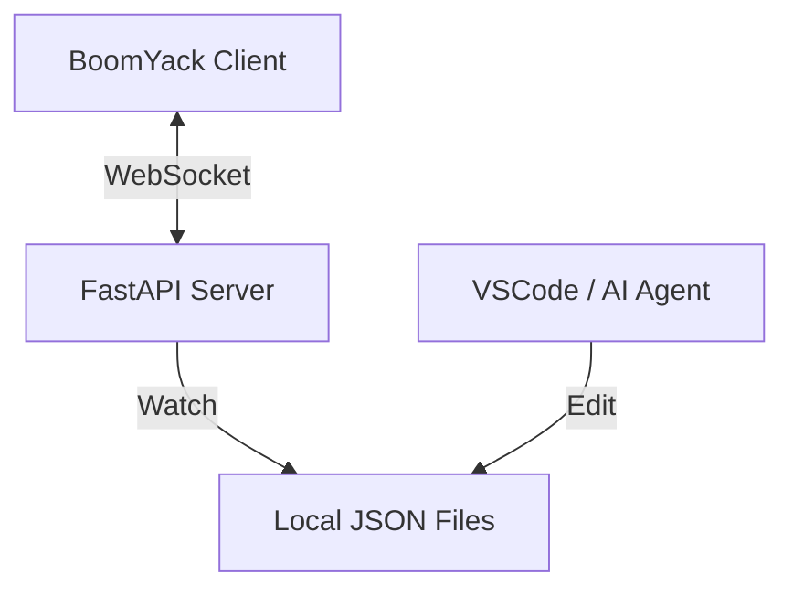

# 提案-010: AI自動生成・ファイル同期基盤 (FastAPI + WebSocket)

## 1. 現状 (Current State)
- BoomYackは現在、クライアントサイド（ブラウザ/Electron）で完結しており、外部システムとのリアルタイムな連携手段を持たない。
- ファイルの変更検知はリロードに依存しているか、未実装。

## 2. 問題点・課題 (Problem / Motivation)
- **外部ツールとの非同期性**: VSCodeやAI Agentがファイルを編集してもBoomYackに即座に反映されない。
- **AI連携の基盤不在**: 重い処理（LLM推論、RAG検索）をクライアントで行うのは非効率であり、Python資産（LangChain, LlamaIndex等）を活用しにくい。
- **要求**: ユーザーは「AIにファイルを作らせて、それをBoomYackで確認・修正する」サイクルを求めている。

## 3. 提案内容 (Proposed Solution)
Python (FastAPI) によるバックエンドサーバーを構築し、ファイル監視とWebSocketによるリアルタイム同期を実現する。

### 3-1. アーキテクチャ構成


### 3-2. 実装詳細
#### サーバーサイド (Python)
- **フレームワーク**: `FastAPI` + `Uvicorn`
- **ファイル監視**: `watchfiles` ライブラリを使用（Rust製で高速）。
    - ターゲットディレクトリ内の `.json` ファイルの変更（`modify`, `create`, `delete`）を監視。
- **WebSocket**: 
    - クライアント接続を管理 (`ConnectionManager`)。
    - ファイル変更イベントを検知したら、全接続クライアントに通知 (`{"type": "reload", "file": "..."}`).

#### クライアントサイド (TypeScript)
- **接続**: アプリ起動時にWebSocketサーバーへ接続（リトライ機構付き）。
- **イベントハンドリング**: 
    - `reload` メッセージを受信 -> 対象ファイルが開かれていれば再読み込みを実行。
    - ユーザーの操作を阻害しないよう、トースト通知等で「ファイルが更新されました」と表示し、自動更新または手動更新を選択可能にする（UX検討事項）。

### 3-3. コードイメージ (Python)
```python
# 要求.jsonより抜粋・整形
from fastapi import FastAPI, WebSocket
from watchfiles import awatch
import asyncio

app = FastAPI()

async def watch_files_task():
    async for changes in awatch('.', filter=lambda change, path: path.endswith('.json')):
        await manager.broadcast(f"reload:{changes}")

@app.on_event("startup")
async def startup_event():
    asyncio.create_task(watch_files_task())
```

### 3-4. 設計憲法・適合チェック
- [x] DOM操作: WebSocketイベント受信後にSengenUIの再描画フローに乗せる。
- [ ] サーバー実装: 新規領域のため、Python側のコーディング規約（Type hints, Pydantic, Ruff等）を整備する必要がある。

## 4. 影響範囲
- 新規: `server/` ディレクトリ。
- 既存: `ConnectionManager.ts` (仮) の追加、`CanvasGraphModel` へのリロード機能追加。

## 5. 代替案
- **Polling (HTTP)**: 実装は楽だが、リアルタイム性に欠けるため却下。
- **Electron API**: Electronの`fs.watch`を使う手もあるが、将来的なPython AIライブラリ活用のためにFastAPI構成を採用。
