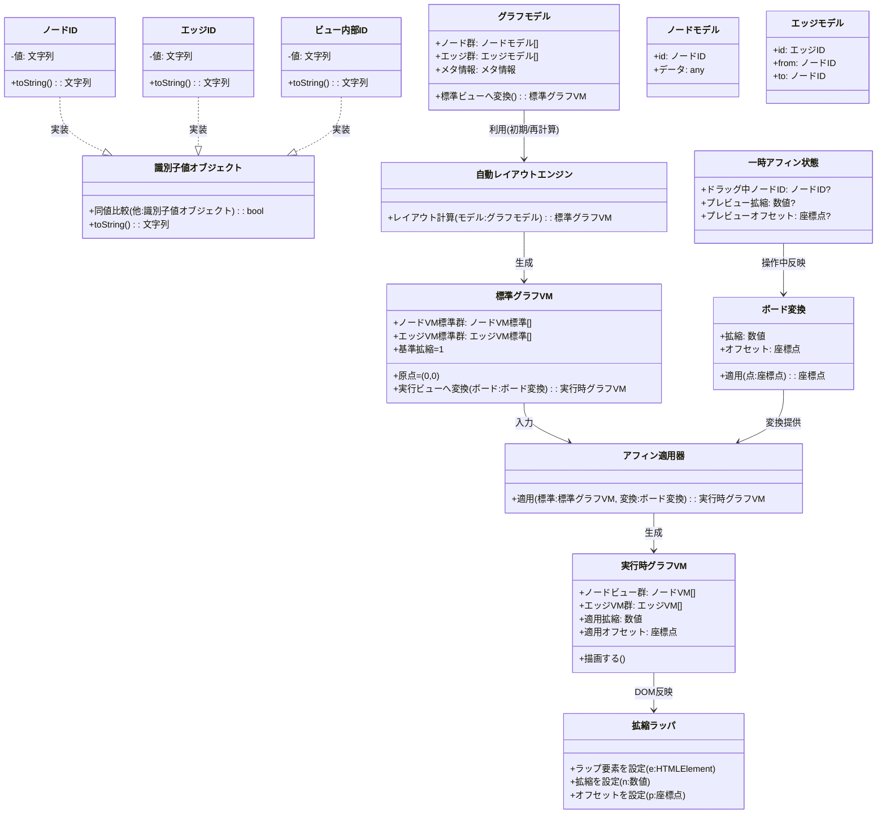

# グラフ描画パイプライン

BoomYackでは、グラフの論理構造（Model）と描画（View）を明確に分離し、DDD（ドメイン駆動設計）の思想を取り入れたパイプラインを採用しています。

## アーキテクチャ概略図

## パイプライン詳細
### 1. Model (グラフモデル)
- **役割:** グラフの純粋なデータ構造を保持します。
- **特徴:** 座標情報を持たず（あるいは抽象的な相対位置のみ）、論理的な接続関係（Topology）に重点を置きます。
- **ID:** すべての要素は厳密に型定義されたID（Value Object）によって一意に識別されます。

### 2. Standard VM (標準グラフVM)
- **役割:** 描画のための正規化された中間表現です。
- **特徴:** 原点(0,0)、スケール1.0の状態でのレイアウト情報を持ちます。自動レイアウトエンジンによって計算される場合と、手動配置の結果が保存される場合があります。

### 3. Runtime VM (実行時グラフVM)
- **役割:** 画面に実際に描画されるピクセル座標を持つViewModelです。
- **特徴:** ユーザーのズーム・パン操作（ボード変換）と、標準VMの情報を合成して算出されます。`アフィン適用器`がこの変換を担います。

### 4. Rendering (描画・DOM反映)
- **役割:** 実行時VMのプロパティを実際のDOM要素（HTML/SVG）に反映します。
- **最適化:** `拡縮ラッパ`を用いることで、ブラウザのCSS Transformを活用し、高速な再描画を実現します。
