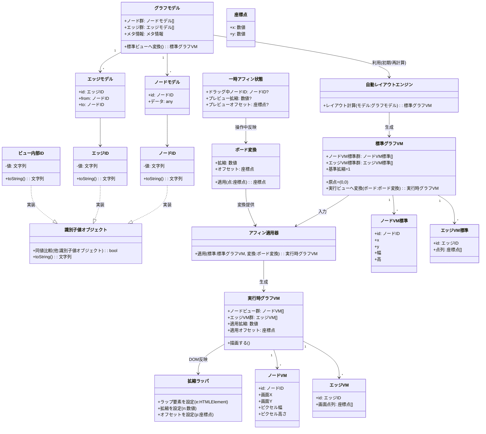

```mermaid
%% DDD的にIDを型で区別（Value Object化）
classDiagram
    direction TB

    class 識別子値オブジェクト {
        +同値比較(他:識別子値オブジェクト): bool
        +toString(): 文字列
    }

    class ノードID {
        -値: 文字列
        +toString(): 文字列
    }
    class エッジID {
        -値: 文字列
        +toString(): 文字列
    }
    class ビュー内部ID {
        -値: 文字列
        +toString(): 文字列
    }

    ノードID ..|> 識別子値オブジェクト : 実装
    エッジID ..|> 識別子値オブジェクト : 実装
    ビュー内部ID ..|> 識別子値オブジェクト : 実装

    class グラフモデル {
        +ノード群: ノードモデル[]
        +エッジ群: エッジモデル[]
        +メタ情報: メタ情報
        +標準ビューへ変換(): 標準グラフVM
    }

    class 標準グラフVM {
        +ノードVM標準群: ノードVM標準[]
        +エッジVM標準群: エッジVM標準[]
        +原点=(0,0)
        +基準拡縮=1
        +実行ビューへ変換(ボード:ボード変換): 実行時グラフVM
    }

    class 実行時グラフVM {
        +ノードビュー群: ノードVM[]
        +エッジVM群: エッジVM[]
        +適用拡縮: 数値
        +適用オフセット: 座標点
        +描画する()
    }

    class ボード変換 {
        +拡縮: 数値
        +オフセット: 座標点
        +適用(点:座標点): 座標点
    }

    class 自動レイアウトエンジン {
        +レイアウト計算(モデル:グラフモデル): 標準グラフVM
    }

    class 一時アフィン状態 {
        +ドラッグ中ノードID: ノードID?
        +プレビュー拡縮: 数値?
        +プレビューオフセット: 座標点?
    }

    class アフィン適用器 {
        +適用(標準:標準グラフVM, 変換:ボード変換): 実行時グラフVM
    }

    class 拡縮ラッパ {
        +ラップ要素を設定(e:HTMLElement)
        +拡縮を設定(n:数値)
        +オフセットを設定(p:座標点)
    }

    グラフモデル --> 自動レイアウトエンジン : 利用(初期/再計算)
    自動レイアウトエンジン --> 標準グラフVM : 生成
    標準グラフVM --> アフィン適用器 : 入力
    ボード変換 --> アフィン適用器 : 変換提供
    アフィン適用器 --> 実行時グラフVM : 生成
    実行時グラフVM --> 拡縮ラッパ : DOM反映
    一時アフィン状態 --> ボード変換 : 操作中反映

    class ノードモデル {
        +id: ノードID
        +データ: any
    }
    class エッジモデル {
        +id: エッジID
        +from: ノードID
        +to: ノードID
    }
    class ノードVM標準 {
        +id: ノードID
        +x
        +y
        +幅
        +高
    }
    class エッジVM標準 {
        +id: エッジID
        +点列: 座標点[]
    }
    class ノードVM {
        +id: ノードID
        +画面X
        +画面Y
        +ピクセル幅
        +ピクセル高さ
    }
    class エッジVM {
        +id: エッジID
        +画面点列: 座標点[]
    }
    class 座標点 {
        +x: 数値
        +y: 数値
    }

    グラフモデル "1" --> "*" ノードモデル
    ノードモデル --> ノードID
    エッジモデル --> エッジID
    グラフモデル "1" --> "*" エッジモデル
    標準グラフVM "1" --> "*" ノードVM標準
    標準グラフVM "1" --> "*" エッジVM標準
    実行時グラフVM "1" --> "*" ノードVM
    実行時グラフVM "1" --> "*" エッジVM
```