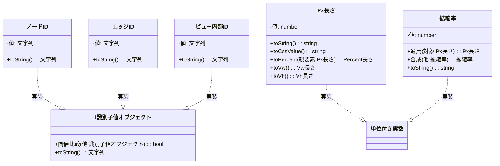
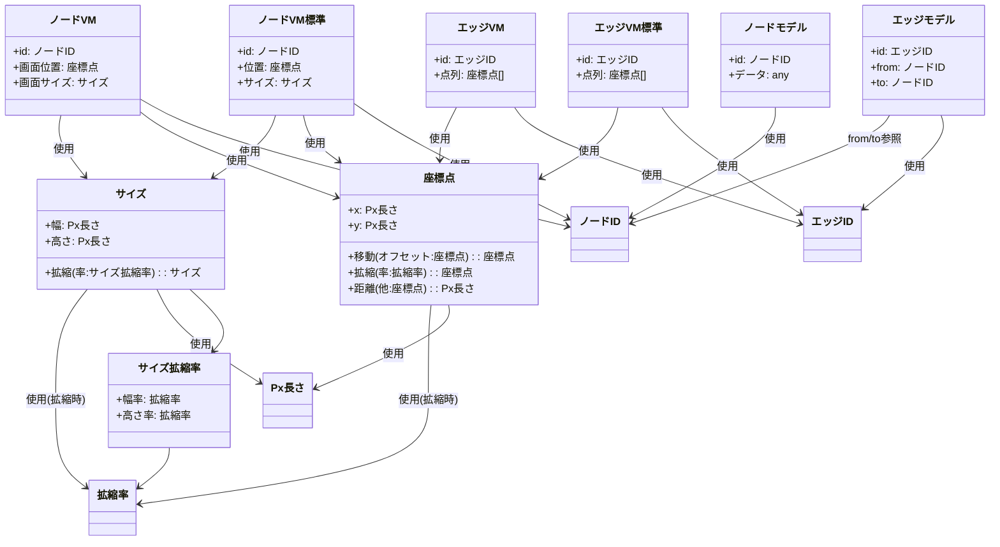

# 基底クラス定義

## Value Object系（ID型・数値型）

```mermaid
classDiagram
    direction TB

    class I識別子値オブジェクト {
        +同値比較(他:識別子値オブジェクト): bool
        +toString(): 文字列
    }

    class 単位付き実数 {
        
    }

    class ノードID {
        -値: 文字列
        +toString(): 文字列
    }
    class エッジID {
        -値: 文字列
        +toString(): 文字列
    }
    class ビュー内部ID {
        -値: 文字列
        +toString(): 文字列
    }

    class Px長さ {
        -値: number
        +toString(): string
        +toCssValue(): string
        +toPercent(親要素:Px長さ): Percent長さ
        +toVw(): Vw長さ
        +toVh(): Vh長さ
    }

    class 拡縮率 {
        -値: number
        +適用(対象:Px長さ): Px長さ
        +合成(他:拡縮率): 拡縮率
        +toString(): string
    }

    ノードID ..|> I識別子値オブジェクト : 実装
    エッジID ..|> I識別子値オブジェクト : 実装
    ビュー内部ID ..|> I識別子値オブジェクト : 実装
    Px長さ ..|> 単位付き実数 : 実装
    拡縮率 ..|> 単位付き実数 : 実装
```

## 基本データ構造

```mermaid
classDiagram
    direction TB

    class 座標点 {
        +x: Px長さ
        +y: Px長さ
        +移動(オフセット:座標点): 座標点
        +拡縮(率:拡縮率): 座標点
        +距離(他:座標点): Px長さ
    }

    class サイズ拡縮率 {
        +幅率: 拡縮率
        +高さ率: 拡縮率
    }

    

    class サイズ {
        +幅: Px長さ
        +高さ: Px長さ
        +拡縮(率:サイズ拡縮率): サイズ
    }
    サイズ拡縮率 --> 拡縮率
    サイズ --> サイズ拡縮率

    class ノードモデル {
        +id: ノードID
        +データ: any
    }
    class エッジモデル {
        +id: エッジID
        +from: ノードID
        +to: ノードID
    }

    class ノードVM標準 {
        +id: ノードID
        +位置: 座標点
        +サイズ: サイズ
    }
    class エッジVM標準 {
        +id: エッジID
        +点列: 座標点[]
    }

    class ノードVM {
        +id: ノードID
        +画面位置: 座標点
        +画面サイズ: サイズ
    }
    class エッジVM {
        +id: エッジID
        +点列: 座標点[]
    }

    %% 依存関係
    座標点 --> Px長さ : 使用
    サイズ --> Px長さ : 使用
    座標点 --> 拡縮率 : 使用(拡縮時)
    サイズ --> 拡縮率 : 使用(拡縮時)
    ノードモデル --> ノードID : 使用
    エッジモデル --> エッジID : 使用
    エッジモデル --> ノードID : from/to参照
    ノードVM標準 --> ノードID : 使用
    ノードVM標準 --> 座標点 : 使用
    ノードVM標準 --> サイズ : 使用
    エッジVM標準 --> エッジID : 使用
    エッジVM標準 --> 座標点 : 使用
    ノードVM --> ノードID : 使用
    ノードVM --> 座標点 : 使用
    ノードVM --> サイズ : 使用
    エッジVM --> エッジID : 使用
    エッジVM --> 座標点 : 使用
```

---
[← README に戻る](README.md)