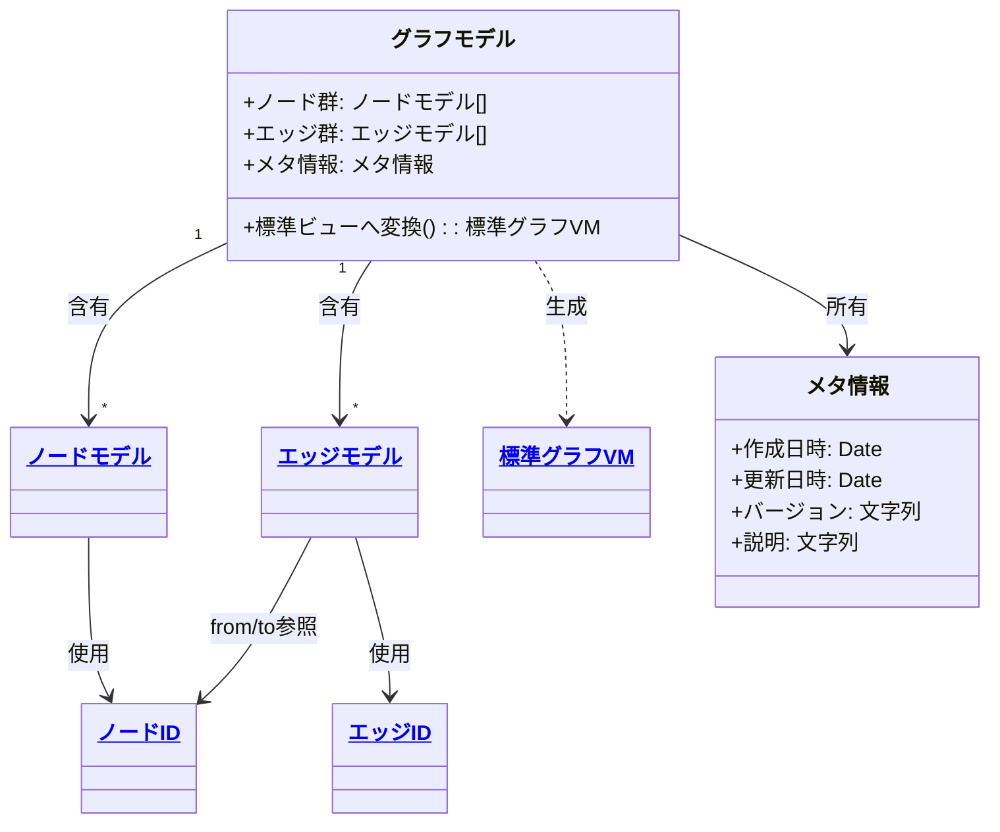

# グラフモデル層

## ドメインモデルとその関係

```mermaid
classDiagram
    direction TB

    %% 他ファイルで定義されたクラス（リンク付き）
    class ノードID["<a class=internal-link href='./01_基底クラス定義.md#ノードID'>ノードID</a>"]
    class エッジID["<a class=internal-link href='./01_基底クラス定義.md#エッジID'>エッジID</a>"]
    class ノードモデル["<a class=internal-link href='./01_基底クラス定義.md#ノードモデル'>ノードモデル</a>"]
    class エッジモデル["<a class=internal-link href='./01_基底クラス定義.md#エッジモデル'>エッジモデル</a>"]
    class 標準グラフVM["<a class=internal-link href='./03_ビューモデル層.md#標準グラフVM'>標準グラフVM</a>"]

    %% この層で定義するクラス
    class グラフモデル {
        +ノード群: ノードモデル[]
        +エッジ群: エッジモデル[]
        +メタ情報: メタ情報
        +標準ビューへ変換(): 標準グラフVM
    }

    class メタ情報 {
        +作成日時: Date
        +更新日時: Date
        +バージョン: 文字列
        +説明: 文字列
    }

    %% 関係
    グラフモデル "1" --> "*" ノードモデル : 含有
    グラフモデル "1" --> "*" エッジモデル : 含有
    グラフモデル --> メタ情報 : 所有
    ノードモデル --> ノードID : 使用
    エッジモデル --> エッジID : 使用
    エッジモデル --> ノードID : from/to参照
    グラフモデル ..> 標準グラフVM : 生成
```

---
[← README に戻る](README.md)