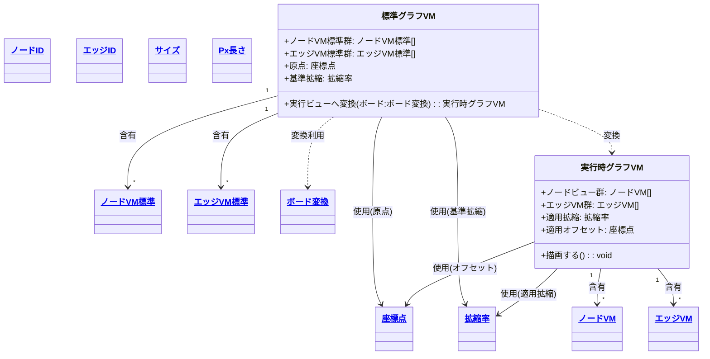

# ビューモデル層

## 標準ビューと実行時ビューの関係

```mermaid
classDiagram
    direction TB

    %% 他ファイルで定義されたクラス（リンク付き）
    class ノードID["<a class=internal-link href='./01_基底クラス定義.md#ノードID'>ノードID</a>"]
    class エッジID["<a class=internal-link href='./01_基底クラス定義.md#エッジID'>エッジID</a>"]
    class 座標点["<a class=internal-link href='./01_基底クラス定義.md#座標点'>座標点</a>"]
    class サイズ["<a class=internal-link href='./01_基底クラス定義.md#サイズ'>サイズ</a>"]
    class Px長さ["<a class=internal-link href='./01_基底クラス定義.md#Px長さ'>Px長さ</a>"]
    class 拡縮率["<a class=internal-link href='./01_基底クラス定義.md#拡縮率'>拡縮率</a>"]
    class ノードVM標準["<a class=internal-link href='./01_基底クラス定義.md#ノードVM標準'>ノードVM標準</a>"]
    class エッジVM標準["<a class=internal-link href='./01_基底クラス定義.md#エッジVM標準'>エッジVM標準</a>"]
    class ノードVM["<a class=internal-link href='./01_基底クラス定義.md#ノードVM'>ノードVM</a>"]
    class エッジVM["<a class=internal-link href='./01_基底クラス定義.md#エッジVM'>エッジVM</a>"]
    class ボード変換["<a class=internal-link href='./04_座標変換レイアウト層.md#ボード変換'>ボード変換</a>"]

    %% この層で定義するクラス
    class 標準グラフVM {
        +ノードVM標準群: ノードVM標準[]
        +エッジVM標準群: エッジVM標準[]
        +原点: 座標点
        +基準拡縮: 拡縮率
        +実行ビューへ変換(ボード:ボード変換): 実行時グラフVM
    }

    class 実行時グラフVM {
        +ノードビュー群: ノードVM[]
        +エッジVM群: エッジVM[]
        +適用拡縮: 拡縮率
        +適用オフセット: 座標点
        +描画する(): void
    }

    %% 関係
    標準グラフVM "1" --> "*" ノードVM標準 : 含有
    標準グラフVM "1" --> "*" エッジVM標準 : 含有
    標準グラフVM --> 座標点 : 使用(原点)
    標準グラフVM --> 拡縮率 : 使用(基準拡縮)
    実行時グラフVM "1" --> "*" ノードVM : 含有
    実行時グラフVM "1" --> "*" エッジVM : 含有
    実行時グラフVM --> 座標点 : 使用(オフセット)
    実行時グラフVM --> 拡縮率 : 使用(適用拡縮)
    標準グラフVM ..> 実行時グラフVM : 変換
    標準グラフVM ..> ボード変換 : 変換利用
```

---
[← README に戻る](README.md)