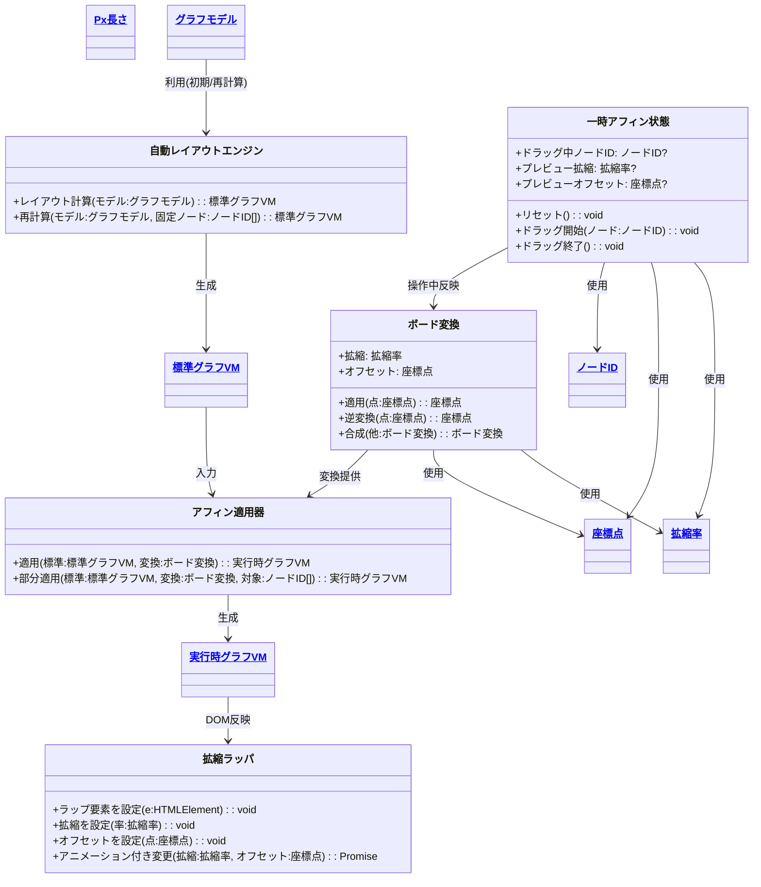

# 座標変換・レイアウト層

## アフィン変換とレイアウトエンジンの関係

```mermaid
classDiagram
    direction TB

    %% 他ファイルで定義されたクラス（リンク付き）
    class ノードID["<a class=internal-link href='./01_基底クラス定義.md#ノードID'>ノードID</a>"]
    class 座標点["<a class=internal-link href='./01_基底クラス定義.md#座標点'>座標点</a>"]
    class Px長さ["<a class=internal-link href='./01_基底クラス定義.md#Px長さ'>Px長さ</a>"]
    class 拡縮率["<a class=internal-link href='./01_基底クラス定義.md#拡縮率'>拡縮率</a>"]
    class グラフモデル["<a class=internal-link href='./02_グラフモデル層.md#グラフモデル'>グラフモデル</a>"]
    class 標準グラフVM["<a class=internal-link href='./03_ビューモデル層.md#標準グラフVM'>標準グラフVM</a>"]
    class 実行時グラフVM["<a class=internal-link href='./03_ビューモデル層.md#実行時グラフVM'>実行時グラフVM</a>"]

    %% この層で定義するクラス
    class ボード変換 {
        +拡縮: 拡縮率
        +オフセット: 座標点
        +適用(点:座標点): 座標点
        +逆変換(点:座標点): 座標点
        +合成(他:ボード変換): ボード変換
    }

    class 自動レイアウトエンジン {
        +レイアウト計算(モデル:グラフモデル): 標準グラフVM
        +再計算(モデル:グラフモデル, 固定ノード:ノードID[]): 標準グラフVM
    }

    class 一時アフィン状態 {
        +ドラッグ中ノードID: ノードID?
        +プレビュー拡縮: 拡縮率?
        +プレビューオフセット: 座標点?
        +リセット(): void
        +ドラッグ開始(ノード:ノードID): void
        +ドラッグ終了(): void
    }

    class アフィン適用器 {
        +適用(標準:標準グラフVM, 変換:ボード変換): 実行時グラフVM
        +部分適用(標準:標準グラフVM, 変換:ボード変換, 対象:ノードID[]): 実行時グラフVM
    }

    class 拡縮ラッパ {
        +ラップ要素を設定(e:HTMLElement): void
        +拡縮を設定(率:拡縮率): void
        +オフセットを設定(点:座標点): void
        +アニメーション付き変更(拡縮:拡縮率, オフセット:座標点): Promise<void>
    }

    %% 関係
    グラフモデル --> 自動レイアウトエンジン : 利用(初期/再計算)
    自動レイアウトエンジン --> 標準グラフVM : 生成
    標準グラフVM --> アフィン適用器 : 入力
    ボード変換 --> アフィン適用器 : 変換提供
    アフィン適用器 --> 実行時グラフVM : 生成
    実行時グラフVM --> 拡縮ラッパ : DOM反映
    一時アフィン状態 --> ボード変換 : 操作中反映
    ボード変換 --> 座標点 : 使用
    ボード変換 --> 拡縮率 : 使用
    一時アフィン状態 --> ノードID : 使用
    一時アフィン状態 --> 座標点 : 使用
    一時アフィン状態 --> 拡縮率 : 使用
```

---
[← README に戻る](README.md)