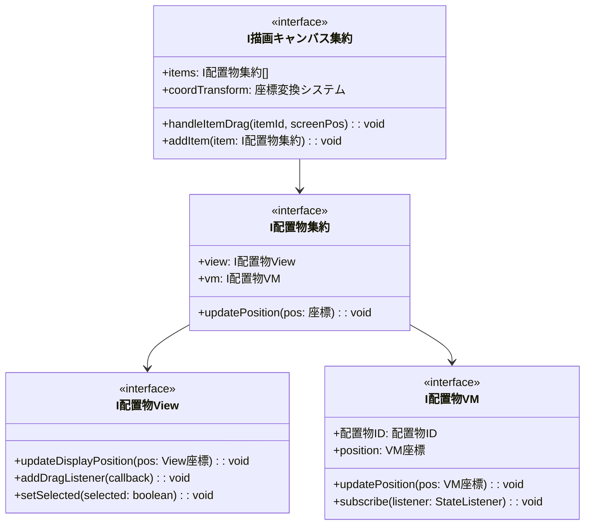
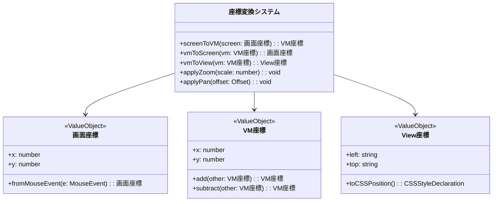
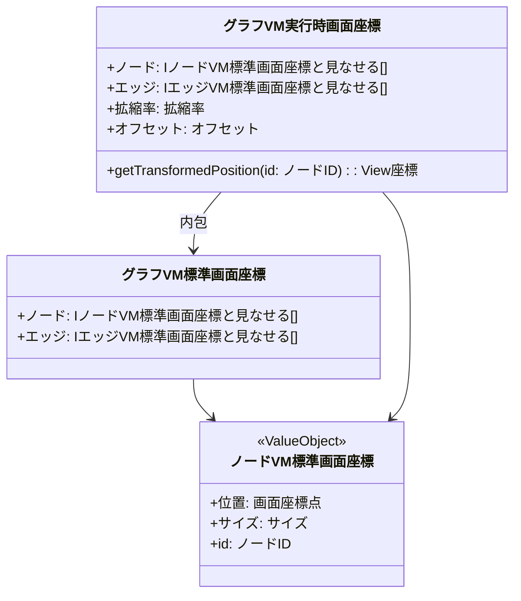

# 01_基底アーキテクチャ

## 全体アーキテクチャ

### レイヤー構成


### 座標系設計

#### 座標系の種類と役割


## CSS設計方針

### position: absolute採用の理由

```typescript
// 配置物ViewのCSS設計
export abstract class 配置物ViewBase extends LV2UIComponentBase {
    protected createComponentRoot(): DivC {
        return new DivC({})
            .setStyleCSS({
                position: 'absolute',  // 重要: 親要素基準の絶対座標
                left: '0px',
                top: '0px',
                cursor: 'grab',
                userSelect: 'none',     // ドラッグ時のテキスト選択防止
                zIndex: '1'             // 重なり順制御
            })
            .addClassName('draggable-item');
    }
    
    public updateDisplayPosition(viewPos: View座標): void {
        this._componentRoot.setStyleCSS({
            left: viewPos.left,
            top: viewPos.top
        });
    }
}
```

**position: absolute採用理由**:
1. **滑らかなドラッグ**: マウス座標と要素座標が正確に一致
2. **親要素基準**: 描画キャンバス内での正確な位置制御
3. **レイアウト分離**: 他要素への影響なし
4. **Z-index制御**: 重なり順の柔軟な制御が可能

### 描画キャンバスのCSS設計

```typescript
export class 描画キャンバスView extends LV2UIComponentBase {
    protected createComponentRoot(): DivC {
        return new DivC({})
            .setStyleCSS({
                position: 'relative',   // 子要素のabsolute基準となる
                width: '100%',
                height: '100%',
                overflow: 'hidden',     // キャンバス外は非表示
                background: '#f5f5f5'
            })
            .addClassName('drawing-canvas');
    }
}
```

## 実行時VM vs 標準VM問題の解決

### アプローチ：共通値オブジェクト + 異なる集約



**設計方針**:
1. **値オブジェクト共通化**: 座標系クラスは標準・実行時で共通
2. **集約の分離**: 標準集約と実行時集約で異なる変換ロジック
3. **ジェネリクス活用**: 型安全性を保ちながら再利用性を確保

---
[← README に戻る](./README.md) | [02_ドラッグシステム →](./02_ドラッグシステム.md)