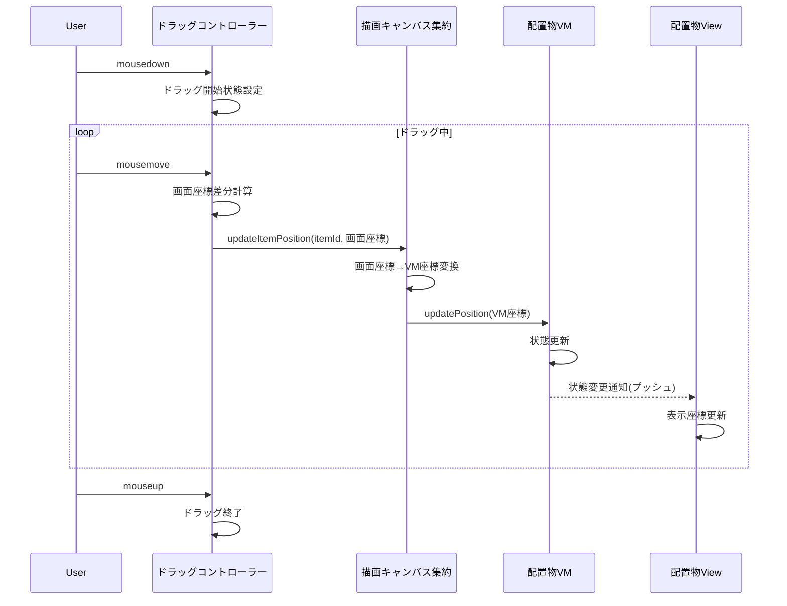

# 02_ドラッグシステム

## カスタムドラッグ実装

### 既存DragMoverが適さない理由
- **直接DOM操作**: VMを経由しない状態更新
- **座標変換不対応**: 拡縮・パン操作との整合性なし
- **状態管理分離**: MVVMパターンとの不整合

### カスタムドラッグコントローラー設計



## 実装コード

### ドラッグコントローラー

```typescript
export class 配置物ドラッグコントローラー {
    private isDragging = false;
    private startScreenPos: 画面座標;
    private initialVMPos: VM座標;
    private dragStartOffset: { x: number, y: number };

    constructor(
        private itemId: 配置物ID,
        private view: I配置物View,
        private canvasAggregate: I描画キャンバス集約
    ) {
        this.setupDragEvents();
    }

    private setupDragEvents(): void {
        this.view.addMouseDownListener((e: MouseEvent) => {
            this.startDrag(e);
        });

        // グローバルイベントでドラッグ継続
        document.addEventListener('mousemove', (e: MouseEvent) => {
            this.onDragMove(e);
        });

        document.addEventListener('mouseup', () => {
            this.endDrag();
        });
    }

    private startDrag(e: MouseEvent): void {
        e.preventDefault();
        e.stopPropagation();
        
        this.isDragging = true;
        this.startScreenPos = 画面座標.fromMouseEvent(e);
        this.initialVMPos = this.canvasAggregate.getItemVMPosition(this.itemId);
        
        // マウス位置と要素位置の差分を記録（正確なドラッグのため）
        const viewRect = this.view.getBoundingClientRect();
        this.dragStartOffset = {
            x: e.clientX - viewRect.left,
            y: e.clientY - viewRect.top
        };
        
        this.view.setDragState(true);
        document.body.style.cursor = 'grabbing';
    }

    private onDragMove(e: MouseEvent): void {
        if (!this.isDragging) return;
        
        const currentScreenPos = 画面座標.fromMouseEvent(e);
        const deltaScreen = currentScreenPos.subtract(this.startScreenPos);
        
        // VM座標系での新しい位置を計算
        const deltaVM = this.canvasAggregate.screenDeltaToVMDelta(deltaScreen);
        const newVMPos = this.initialVMPos.add(deltaVM);
        
        // 集約経由で位置更新（座標変換含む）
        this.canvasAggregate.updateItemPosition(this.itemId, newVMPos);
    }

    private endDrag(): void {
        if (!this.isDragging) return;
        
        this.isDragging = false;
        this.view.setDragState(false);
        document.body.style.cursor = 'default';
        
        // ドラッグ完了イベント（必要に応じて）
        this.canvasAggregate.onItemDragComplete(this.itemId);
    }
}
```

### 描画キャンバス集約での座標変換

```typescript
export class 描画キャンバス集約 implements I描画キャンバス集約 {
    private coordTransform: 座標変換システム;
    private items: Map<配置物ID, I配置物集約> = new Map();

    public updateItemPosition(itemId: 配置物ID, newVMPos: VM座標): void {
        const item = this.items.get(itemId);
        if (!item) return;

        // 1. VMデータ更新
        item.vm.updatePosition(newVMPos);
        
        // 2. View表示座標に変換
        const viewPos = this.coordTransform.vmToView(newVMPos);
        
        // 3. View表示更新（プッシュ型なので自動実行される場合もある）
        item.view.updateDisplayPosition(viewPos);
    }

    public screenDeltaToVMDelta(screenDelta: 画面座標): VM座標 {
        // 現在の拡縮率とパンオフセットを考慮した変換
        const scale = this.coordTransform.getCurrentScale();
        return new VM座標(
            screenDelta.x / scale,
            screenDelta.y / scale
        );
    }

    public getItemVMPosition(itemId: 配置物ID): VM座標 {
        const item = this.items.get(itemId);
        return item?.vm.position || new VM座標(0, 0);
    }
}
```

## ドラッグ時の視覚的フィードバック

### CSS状態管理

```typescript
export abstract class 配置物ViewBase extends LV2UIComponentBase {
    public setDragState(isDragging: boolean): void {
        if (isDragging) {
            this._componentRoot
                .addClassName('dragging')
                .setStyleCSS({
                    cursor: 'grabbing',
                    zIndex: '1000',      // ドラッグ中は最前面
                    opacity: '0.8',      // 半透明でドラッグ中を表現
                    transform: 'scale(1.02)' // 若干拡大
                });
        } else {
            this._componentRoot
                .removeClassName('dragging')
                .setStyleCSS({
                    cursor: 'grab',
                    zIndex: '1',
                    opacity: '1',
                    transform: 'scale(1)'
                });
        }
    }
}
```

### CSS定義

```css
.draggable-item {
    transition: opacity 0.2s ease, transform 0.2s ease;
}

.draggable-item:hover {
    box-shadow: 0 2px 8px rgba(0,0,0,0.15);
}

.draggable-item.dragging {
    box-shadow: 0 8px 25px rgba(0,0,0,0.25);
    transition: none; /* ドラッグ中はトランジション無効 */
}
```

---
[← 01_基底アーキテクチャ](./01_基底アーキテクチャ.md) | [03_状態管理フロー →](./03_状態管理フロー.md)