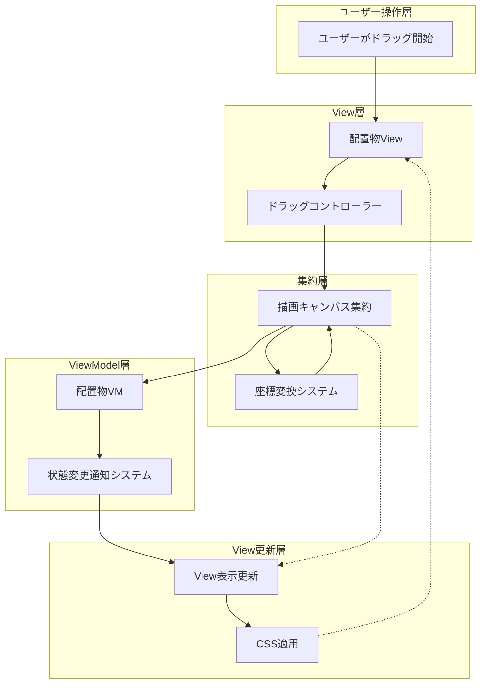

# 03_状態管理フロー（プッシュ型MVVM）

## プッシュ型MVVM採用理由

### プル型 vs プッシュ型比較

| 特徴 | プル型 | プッシュ型（採用） |
|------|--------|--------------------|
| **更新タイミング** | View側でVM状態を問い合わせ | VM変更時に自動でView通知 |
| **リアルタイム性** | 定期的なポーリングが必要 | 即座に反映 |
| **パフォーマンス** | 不要な問い合わせが発生 | 必要時のみ更新 |
| **デバッグ性** | 更新タイミングが不明確 | 状態変更が追跡可能 |
| **複雑さ** | シンプル | 通知システムが必要 |

**結論**: ドラッグ操作時のリアルタイム性を重視し、**プッシュ型**を採用

## 状態更新フローの詳細



## Observer Pattern実装

### VM側の状態通知システム

```typescript
export interface IStateChangeListener<T> {
    onStateChanged(newState: T, oldState: T): void;
}

export abstract class ObservableVM<T> {
    private listeners: IStateChangeListener<T>[] = [];
    private _state: T;

    constructor(initialState: T) {
        this._state = initialState;
    }

    public get state(): T {
        return this._state;
    }

    protected setState(newState: T): void {
        const oldState = this._state;
        this._state = newState;
        this.notifyStateChange(newState, oldState);
    }

    public subscribe(listener: IStateChangeListener<T>): void {
        this.listeners.push(listener);
    }

    public unsubscribe(listener: IStateChangeListener<T>): void {
        const index = this.listeners.indexOf(listener);
        if (index > -1) {
            this.listeners.splice(index, 1);
        }
    }

    private notifyStateChange(newState: T, oldState: T): void {
        this.listeners.forEach(listener => {
            try {
                listener.onStateChanged(newState, oldState);
            } catch (error) {
                console.error('State change notification error:', error);
            }
        });
    }
}
```

### 配置物VM実装

```typescript
export interface I配置物VMState {
    position: VM座標;
    size: サイズ;
    selected: boolean;
    visible: boolean;
}

export class 付箋VM extends ObservableVM<I配置物VMState> implements I配置物VM {
    public readonly 配置物ID: 配置物ID;
    public readonly 配置物種別 = '付箋' as const;

    constructor(id: 配置物ID, initialPosition: VM座標) {
        const initialState: I配置物VMState = {
            position: initialPosition,
            size: new サイズ(new Px長さ(200), new Px長さ(150)),
            selected: false,
            visible: true
        };
        
        super(initialState);
        this.配置物ID = id;
    }

    public updatePosition(newPosition: VM座標): void {
        this.setState({
            ...this.state,
            position: newPosition
        });
    }

    public setSelected(selected: boolean): void {
        this.setState({
            ...this.state,
            selected
        });
    }

    public get position(): VM座標 {
        return this.state.position;
    }
}
```

### View側の状態監視

```typescript
export class 付箋View extends 配置物ViewBase implements I付箋View {
    private vmStateListener: IStateChangeListener<I配置物VMState>;
    private vm: I配置物VM;

    constructor() {
        super();
        this.setupStateListener();
    }

    public bindVM(vm: I配置物VM): void {
        // 既存VMの購読解除
        if (this.vm) {
            this.vm.unsubscribe(this.vmStateListener);
        }
        
        this.vm = vm;
        
        // 新しいVMの購読開始
        this.vm.subscribe(this.vmStateListener);
        
        // 初期状態の適用
        this.applyVMState(this.vm.state);
    }

    private setupStateListener(): void {
        this.vmStateListener = {
            onStateChanged: (newState: I配置物VMState, oldState: I配置物VMState) => {
                this.handleVMStateChange(newState, oldState);
            }
        };
    }

    private handleVMStateChange(
        newState: I配置物VMState, 
        oldState: I配置物VMState
    ): void {
        // 位置変更の処理
        if (!newState.position.equals(oldState.position)) {
            this.updatePositionDisplay(newState.position);
        }
        
        // 選択状態変更の処理
        if (newState.selected !== oldState.selected) {
            this.updateSelectionDisplay(newState.selected);
        }
        
        // 可視性変更の処理
        if (newState.visible !== oldState.visible) {
            this.updateVisibilityDisplay(newState.visible);
        }
    }

    private updatePositionDisplay(vmPosition: VM座標): void {
        // 座標変換は集約経由で行う（後述）
        const viewPos = this.canvasAggregate.vmToViewCoordinate(vmPosition);
        this.updateDisplayPosition(viewPos);
    }

    private updateSelectionDisplay(selected: boolean): void {
        if (selected) {
            this._componentRoot.addClassName('selected');
        } else {
            this._componentRoot.removeClassName('selected');
        }
    }

    private updateVisibilityDisplay(visible: boolean): void {
        this._componentRoot.setStyleCSS({
            display: visible ? 'block' : 'none'
        });
    }
}
```

## パフォーマンス最適化

### バッチ更新システム

```typescript
export class BatchUpdateManager {
    private pendingUpdates = new Set<() => void>();
    private updateScheduled = false;

    public scheduleUpdate(updateFn: () => void): void {
        this.pendingUpdates.add(updateFn);
        
        if (!this.updateScheduled) {
            this.updateScheduled = true;
            requestAnimationFrame(() => {
                this.flushUpdates();
            });
        }
    }

    private flushUpdates(): void {
        this.pendingUpdates.forEach(updateFn => {
            try {
                updateFn();
            } catch (error) {
                console.error('Batch update error:', error);
            }
        });
        
        this.pendingUpdates.clear();
        this.updateScheduled = false;
    }
}

// 使用例: ドラッグ中の連続更新最適化
export class 描画キャンバス集約 implements I描画キャンバス集約 {
    private batchUpdateManager = new BatchUpdateManager();

    public updateItemPosition(itemId: 配置物ID, newVMPos: VM座標): void {
        // 重要な更新は即座に実行
        const item = this.items.get(itemId);
        if (!item) return;
        
        item.vm.updatePosition(newVMPos);
        
        // View更新はバッチ処理でパフォーマンス向上
        this.batchUpdateManager.scheduleUpdate(() => {
            const viewPos = this.coordTransform.vmToView(newVMPos);
            item.view.updateDisplayPosition(viewPos);
        });
    }
}
```

## エラーハンドリングと復旧

```typescript
export class RobustStateManager {
    private static readonly MAX_RETRY_COUNT = 3;
    
    public static safeStateUpdate<T>(
        vm: ObservableVM<T>, 
        updateFn: (currentState: T) => T
    ): boolean {
        let retryCount = 0;
        
        while (retryCount < this.MAX_RETRY_COUNT) {
            try {
                const currentState = vm.state;
                const newState = updateFn(currentState);
                vm.setState(newState);
                return true;
            } catch (error) {
                retryCount++;
                console.warn(`State update retry ${retryCount}:`, error);
                
                if (retryCount >= this.MAX_RETRY_COUNT) {
                    console.error('State update failed after max retries:', error);
                    return false;
                }
            }
        }
        
        return false;
    }
}
```

---
[← 02_ドラッグシステム](./02_ドラッグシステム.md) | [04_実装ガイド →](./04_実装ガイド.md)