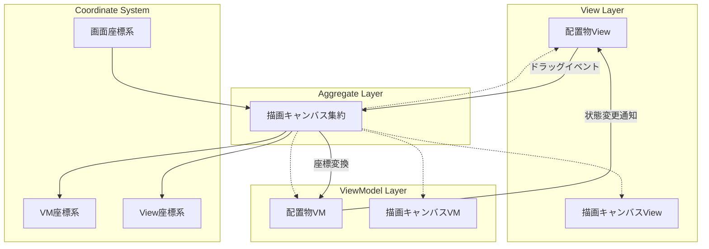

# 配置物ドラッグシステム設計書（2025年9月28日版）

## 概要
Miroライクなドラッグ可能な配置物システムの設計。MVVMパターンを採用し、座標変換と状態管理を分離した堅牢なアーキテクチャを提供する。

## MVVMパターン採用方針

### プッシュ型MVVM採用
配置物システムでは**プッシュ型MVVM**を採用する。

**採用理由**:
1. **リアルタイム性**: ドラッグ操作時の即座な反映が必要
2. **状態の整合性**: VM変更時に全関連Viewが自動更新される
3. **デバッグ性**: 状態変更の流れが明確で追跡しやすい
4. **パフォーマンス**: 必要な時のみView更新が発生

## ファイル構成

1. **[01_基底アーキテクチャ.md](./01_基底アーキテクチャ.md)** - 全体アーキテクチャと座標系設計
2. **[02_ドラッグシステム.md](./02_ドラッグシステム.md)** - ドラッグ操作の実装設計
3. **[03_状態管理フロー.md](./03_状態管理フロー.md)** - プッシュ型MVVMの状態更新フロー
4. **[04_実装ガイド.md](./04_実装ガイド.md)** - 具体的な実装例とコードサンプル

## データフロー概要

---
[← 親フォルダに戻る](../README.md)