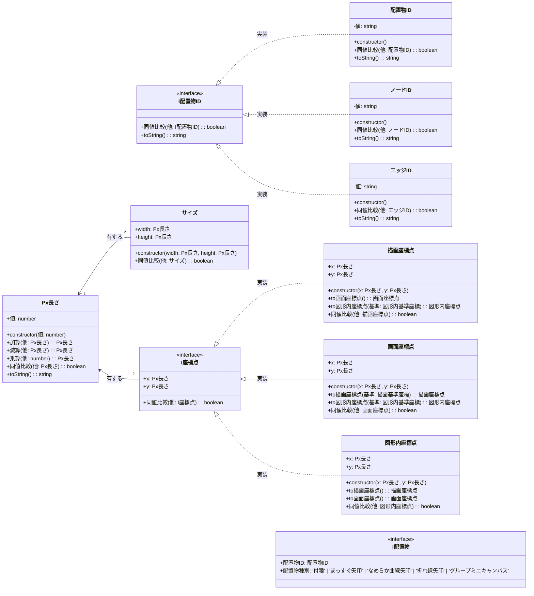

# 01_基底クラス定義

基本的なValueObject、ID型、座標型などの基盤クラス群を定義します。

## 説明

### ID系 Value Object
- すべてのIDは一意性を保証
- 同値比較や文字列変換をサポート

### 座標系 Value Object
- 3つの座標系間で相互変換可能
- 型安全性を確保し、座標系の混同を防止

### 配置物基本インターフェース
- すべての配置オブジェクトが実装すべきインターフェース
- タイプセーフな種別判定を可能にします

---
[← README に戻る](./README.md)