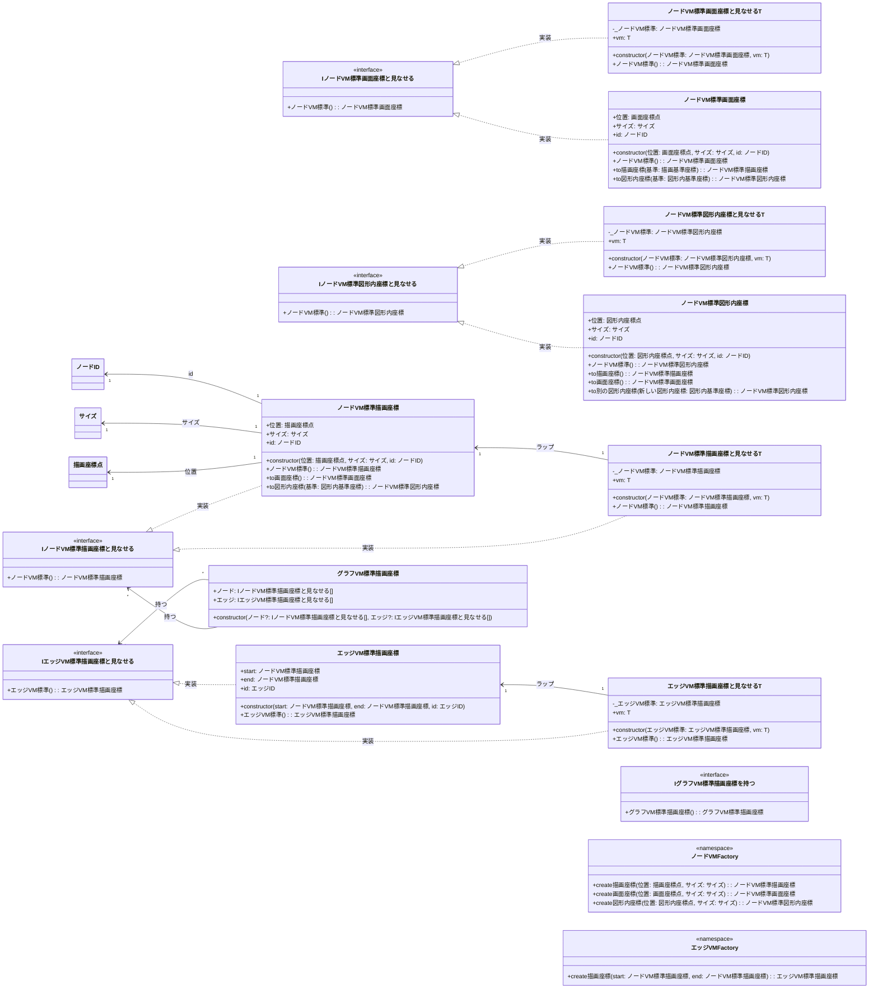

# 02_グラフモデル層

ノード・VM・エッジVM系クラスと、座標変換システム、「〜と見なせる」ラップクラスを定義します。

## 説明

### 座標系変換システム
- 3つの座標系（描画・画面・図形内）を相互変換
- 型安全性を確保し、間違った座標系の混同を防止

### 「〜と見なせる」ラップクラス
- ノードVM情報と配置物固有の情報を組み合わせ
- ジェネリクスでタイプセーフな組み合わせを実現
- Adapterパターンの実装

### グラフ集約クラス
- ノードとエッジのコレクションを管理
- 一つの座標系で统一されたグラフを表現

### ファクトリー関数
- 型安全なオブジェクト作成をサポート
- IDの自動生成で作成を簡単化

---
[← README に戻る](./README.md)