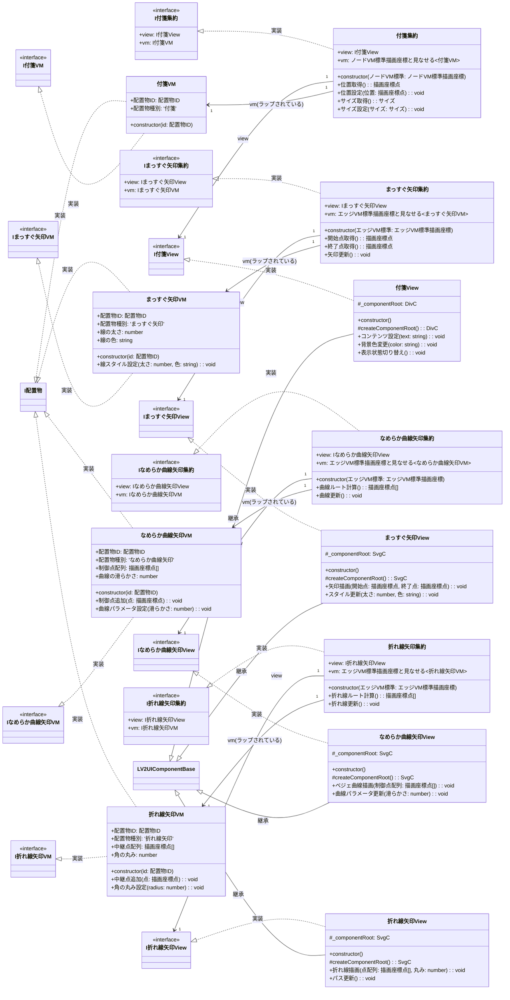

# 03_配置物層

付箋・矢印系の具体的な配置オブジェクトを定義します。集約パターンでViewとVMを分離し、ノードVMラップクラスと結合しています。

## 説明

### 集約パターンの実装
- 各配置物はViewとVMを集約クラスで結合
- インターフェースによる型安全な抽象化
- 外部からはViewとVMに直接アクセスさせず、集約経由で操作

### ラップクラスとの結合
- 付箋はノードVMと結合（単一点に配置）
- 矢印系はエッジVMと結合（2点間を結ぶ）
- 「〜と見なせる」クラスでノード情報と配置物情報を統合

### View層のUIコンポーネント
- 付箋はDivCを使用したHTML要素
- 矢印系はSvgCを使用したSVG描画
- 各種スタイルやアニメーションをサポート

### VM層のビジネスロジック
- 各配置物固有の状態と振る舞いを管理
- I配置物インターフェースを実装して種別を明示
- 座標系に依存しない純粋なビジネスロジック

---
[← README に戻る](./README.md)