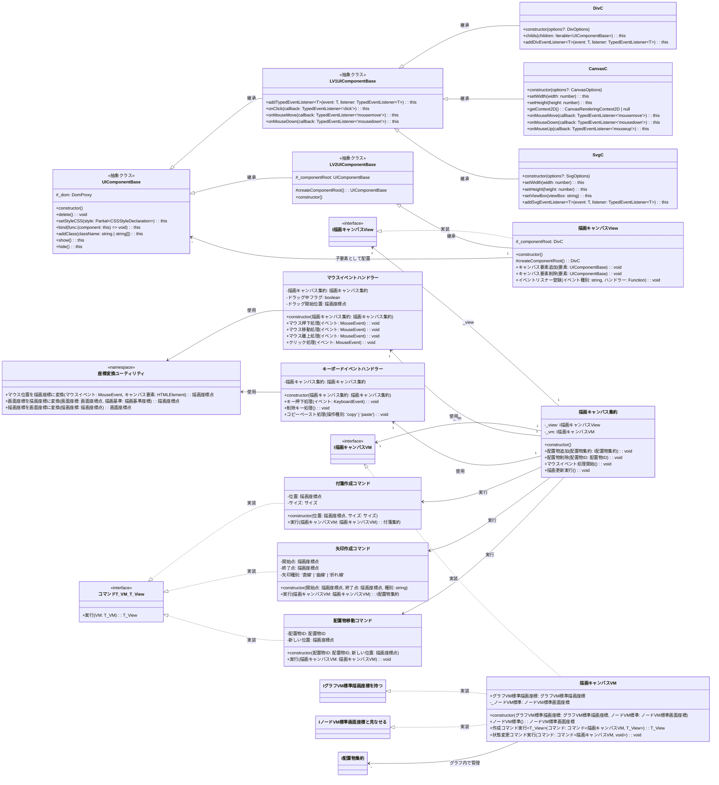

# 04_描画キャンバス層

描画キャンバス集約とUIコンポーネントとの連携、コマンドパターンによる処理実行を定義します。実際のコード構造に基づいてオブザーバーパターンやイベント処理を含めています。

## 説明

### UIコンポーネント基盤
- **UIComponentBase**: すべてのUIコンポーネントの基本クラス
- **LV1UIComponentBase**: HTML要素に直接対応するコンポーネント
- **LV2UIComponentBase**: LV1を組み合わせて作る複合コンポーネント
- 型安全なイベントリスナー登録をサポート

### 描画キャンバス実装
- **集約パターン**: ViewとVMを分離し、集約クラスで結合
- **グラフVM管理**: 描画座標系でのノード・エッジ情報を保持
- **画面座標系対応**: キャンバス自体は画面座標系のノードとして振る舞う

### コマンドパターン実装
- **作成コマンド**: 新しい配置物の作成処理
- **変更コマンド**: 既存配置物の移動・削除処理
- **Undo/Redo対応**: 将来的なコマンド履歴管理を想定

### イベントハンドリング
- **マウスイベント**: ドラッグ&ドロップ、クリック選択
- **キーボードイベント**: 削除、コピー&ペースト
- **座標変換**: マウス座標から描画座標への変換処理

### 実際のコード構造との対応
- `CanvasC`の`onMouseMove()`、`onMouseDown()`等のメソッドを使用
- `描画キャンバスVM`は`IグラフVM標準描画座標を持つ`と`IノードVM標準画面座標と見なせる`を実装
- コマンドインターフェースは`実行(VM: T_VM): T_View`の形式

---
[← README に戻る](./README.md)