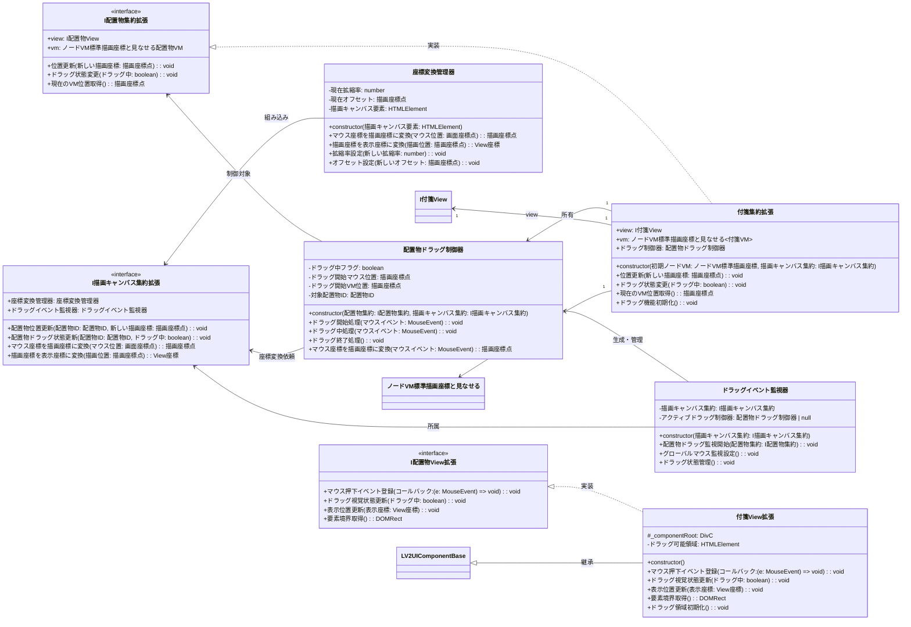
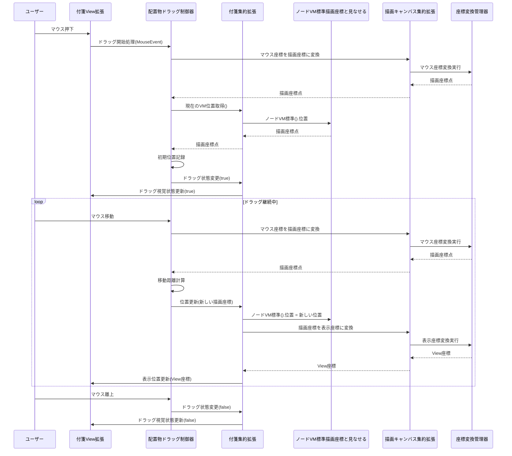

# 05_ドラッグシステム設計

実際のコード構造に基づいた、`ノードVM標準描画座標と見なせる`ラップクラスを活用したドラッグシステムの設計です。



## ドラッグフロー詳細



## 実装詳細

### 配置物ドラッグ制御器

```typescript
export class 配置物ドラッグ制御器 {
    private ドラッグ中フラグ: boolean = false;
    private ドラッグ開始マウス位置: 描画座標点;
    private ドラッグ開始VM位置: 描画座標点;
    private マウス要素オフセット: { x: number, y: number };

    public constructor(
        private 配置物集約: I配置物集約拡張,
        private 描画キャンバス集約: I描画キャンバス集約拡張
    ) {}

    public ドラッグ開始処理(マウスイベント: MouseEvent): void {
        マウスイベント.preventDefault();
        マウスイベント.stopPropagation();

        this.ドラッグ中フラグ = true;
        
        // マウス位置を描画座標に変換
        const マウス画面座標 = new 画面座標点(
            new Px長さ(マウスイベント.clientX), 
            new Px長さ(マウスイベント.clientY)
        );
        this.ドラッグ開始マウス位置 = this.描画キャンバス集約.マウス座標を描画座標に変換(マウス画面座標);
        
        // 現在のVM位置を記録
        this.ドラッグ開始VM位置 = this.配置物集約.現在のVM位置取得();
        
        // 要素内でのマウス位置オフセットを記録
        const 要素境界 = this.配置物集約.view.要素境界取得();
        this.マウス要素オフセット = {
            x: マウスイベント.clientX - 要素境界.left,
            y: マウスイベント.clientY - 要素境界.top
        };
        
        // ドラッグ状態を通知
        this.配置物集約.ドラッグ状態変更(true);
        
        // カーソル変更
        document.body.style.cursor = 'grabbing';
    }

    public ドラッグ中処理(マウスイベント: MouseEvent): void {
        if (!this.ドラッグ中フラグ) return;

        // 現在のマウス位置を描画座標に変換
        const 現在マウス画面座標 = new 画面座標点(
            new Px長さ(マウスイベント.clientX), 
            new Px長さ(マウスイベント.clientY)
        );
        const 現在マウス描画座標 = this.描画キャンバス集約.マウス座標を描画座標に変換(現在マウス画面座標);
        
        // 移動距離を計算
        const 移動距離 = new 描画座標点(
            new Px長さ(現在マウス描画座標.x.値 - this.ドラッグ開始マウス位置.x.値),
            new Px長さ(現在マウス描画座標.y.値 - this.ドラッグ開始マウス位置.y.値)
        );
        
        // 新しい位置を計算
        const 新しい位置 = new 描画座標点(
            new Px長さ(this.ドラッグ開始VM位置.x.値 + 移動距離.x.値),
            new Px長さ(this.ドラッグ開始VM位置.y.値 + 移動距離.y.値)
        );
        
        // 位置を更新
        this.配置物集約.位置更新(新しい位置);
    }

    public ドラッグ終了処理(): void {
        if (!this.ドラッグ中フラグ) return;

        this.ドラッグ中フラグ = false;
        
        // ドラッグ状態を解除
        this.配置物集約.ドラッグ状態変更(false);
        
        // カーソルを戻す
        document.body.style.cursor = 'default';
    }
}
```

### 付箋集約拡張実装

```typescript
export class 付箋集約拡張 implements I配置物集約拡張 {
    public readonly view: I付箋View拡張;
    public readonly vm: ノードVM標準描画座標と見なせる<付箋VM>;
    private ドラッグ制御器: 配置物ドラッグ制御器;

    public constructor(
        初期ノードVM: ノードVM標準描画座標,
        private 描画キャンバス集約: I描画キャンバス集約拡張
    ) {
        const 配置物ID = new 配置物ID();
        this.view = new 付箋View拡張();
        this.vm = new ノードVM標準描画座標と見なせる(初期ノードVM, new 付箋VM(配置物ID));
        
        this.ドラッグ機能初期化();
    }

    public 位置更新(新しい描画座標: 描画座標点): void {
        // ラップクラス内のノードVMの位置を更新
        this.vm.ノードVM標準().位置 = 新しい描画座標;
        
        // 表示座標に変換してView更新
        const 表示座標 = this.描画キャンバス集約.描画座標を表示座標に変換(新しい描画座標);
        this.view.表示位置更新(表示座標);
    }

    public ドラッグ状態変更(ドラッグ中: boolean): void {
        this.view.ドラッグ視覚状態更新(ドラッグ中);
    }

    public 現在のVM位置取得(): 描画座標点 {
        return this.vm.ノードVM標準().位置;
    }

    private ドラッグ機能初期化(): void {
        this.ドラッグ制御器 = new 配置物ドラッグ制御器(this, this.描画キャンバス集約);
        
        // ViewのマウスイベントとドラッグController接続
        this.view.マウス押下イベント登録((マウスイベント: MouseEvent) => {
            this.ドラッグ制御器.ドラッグ開始処理(マウスイベント);
        });
        
        // グローバルマウスイベント設定（既にドラッグイベント監視器で設定済みの場合は不要）
    }
}
```

### 付箋View拡張実装

```typescript
export class 付箋View拡張 extends LV2UIComponentBase implements I付箋View拡張 {
    protected _componentRoot: DivC;
    private ドラッグ可能領域: HTMLElement;

    constructor() {
        super();
        this._componentRoot = this.createComponentRoot();
        this.ドラッグ領域初期化();
    }

    protected createComponentRoot(): DivC {
        return new DivC({}).childs([]).setStyleCSS({
            position: 'absolute',
            width: '200px',
            height: '150px',
            backgroundColor: '#ffeb3b',
            border: '1px solid #ffc107',
            borderRadius: '4px',
            cursor: 'grab',
            userSelect: 'none',
            boxShadow: '0 2px 4px rgba(0,0,0,0.1)',
            padding: '10px',
            fontFamily: '-apple-system, BlinkMacSystemFont, "Segoe UI", Roboto, sans-serif',
            fontSize: '14px'
        }).addClassName('sticky-note');
    }

    public マウス押下イベント登録(コールバック: (e: MouseEvent) => void): void {
        // ドラッグ可能領域でのマウス押下のみ処理
        this.ドラッグ可能領域.addEventListener('mousedown', (e: MouseEvent) => {
            // テキスト編集エリア内でのクリックは除外
            const ターゲット = e.target as HTMLElement;
            if (ターゲット.contentEditable === 'true') {
                return;
            }
            コールバック(e);
        });
    }

    public ドラッグ視覚状態更新(ドラッグ中: boolean): void {
        if (ドラッグ中) {
            this._componentRoot.addClassName('dragging').setStyleCSS({
                cursor: 'grabbing',
                zIndex: '1000',
                opacity: '0.9',
                transform: 'rotate(1deg) scale(1.02)',
                boxShadow: '0 8px 25px rgba(0,0,0,0.25)',
                transition: 'none'
            });
        } else {
            this._componentRoot.removeClassName('dragging').setStyleCSS({
                cursor: 'grab',
                zIndex: '1',
                opacity: '1',
                transform: 'rotate(0deg) scale(1)',
                boxShadow: '0 2px 4px rgba(0,0,0,0.1)',
                transition: 'all 0.2s ease'
            });
        }
    }

    public 表示位置更新(表示座標: View座標): void {
        this._componentRoot.setStyleCSS({
            left: 表示座標.left,
            top: 表示座標.top
        });
    }

    public 要素境界取得(): DOMRect {
        return this._componentRoot.dom.element.getBoundingClientRect();
    }

    private ドラッグ領域初期化(): void {
        // ヘッダー部分をドラッグ可能領域とする
        const ヘッダー = document.createElement('div');
        ヘッダー.style.cssText = `
            position: absolute;
            top: 0;
            left: 0;
            right: 0;
            height: 30px;
            background: linear-gradient(to bottom, rgba(255,255,255,0.2), rgba(255,255,255,0.05));
            border-bottom: 1px solid rgba(0,0,0,0.1);
            cursor: grab;
        `;
        
        this.ドラッグ可能領域 = ヘッダー;
        this._componentRoot.dom.element.appendChild(ヘッダー);
        
        // コンテンツエリアは編集可能
        const コンテンツ = document.createElement('div');
        コンテンツ.contentEditable = 'true';
        コンテンツ.style.cssText = `
            position: absolute;
            top: 35px;
            left: 10px;
            right: 10px;
            bottom: 10px;
            outline: none;
            cursor: text;
            overflow-y: auto;
        `;
        コンテンツ.textContent = 'クリックして編集...';
        
        this._componentRoot.dom.element.appendChild(コンテンツ);
    }
}
```

## CSS定義

```css
.sticky-note {
    transition: box-shadow 0.2s ease, transform 0.2s ease, opacity 0.2s ease;
}

.sticky-note:hover {
    box-shadow: 0 4px 12px rgba(0,0,0,0.15);
}

.sticky-note.selected {
    border: 2px solid #2196f3;
    box-shadow: 0 4px 12px rgba(33, 150, 243, 0.3);
}

.sticky-note.dragging {
    box-shadow: 0 8px 25px rgba(0,0,0,0.25);
    z-index: 1000 !important;
    transition: none;
}

.sticky-note [contenteditable] {
    cursor: text;
    outline: none;
}

.sticky-note [contenteditable]:focus {
    background: rgba(255,255,255,0.8);
    border-radius: 2px;
}
```

---
[← 04_描画キャンバス層](./04_描画キャンバス層.md) | [06_状態管理フロー →](./06_状態管理フロー.md)