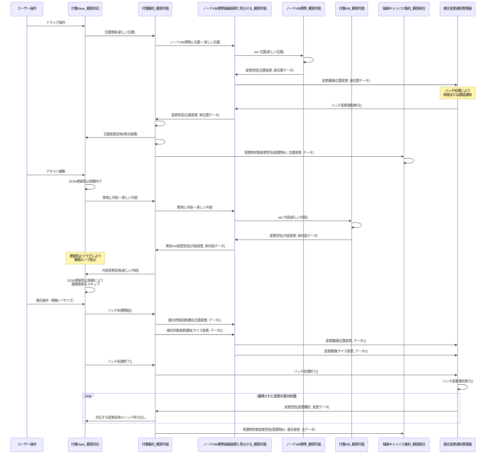

# 06_状態管理フロー

実際のコード構造（`ノードVM標準描画座標と見なせる`ラップクラス）に基づいたObserverパターンによる状態管理フローです。

```mermaid
classDiagram
    direction RL
    
    %% ========== オブザーバーパターン基盤 ==========
    class Observable観測対象 {
        -観測者リスト: Set観測者
        +constructor()
        +観測者登録(観測者: Observer観測者): void
        +観測者削除(観測者: Observer観測者): void
        +変更通知(変更データ: any): void
        #観測者全員に通知(変更データ: any): void
    }
    
    class Observer観測者 {
        <<interface>>
        +変更受信(変更元: Observable観測対象, 変更データ: any): void
    }
    
    %% ========== VM層の状態管理 ==========
    class ノードVM標準描画座標_観測可能 {
        -_位置: 描画座標点
        -_サイズ: サイズ
        -_可視性: boolean
        +constructor(初期位置: 描画座標点, 初期サイズ: サイズ)
        +get 位置(): 描画座標点
        +set 位置(新しい位置: 描画座標点): void
        +get サイズ(): サイズ
        +set サイズ(新しいサイズ: サイズ): void
        +get 可視性(): boolean
        +set 可視性(可視: boolean): void
        #位置変更通知(新しい位置: 描画座標点): void
        #サイズ変更通知(新しいサイズ: サイズ): void
        #可視性変更通知(可視: boolean): void
    }
    
    class ノードVM標準描画座標と見なせる_観測可能~T~ {
        -ノードVM標準: ノードVM標準描画座標_観測可能
        -実体VM: T
        -複合変更通知管理器: 複合変更通知管理器
        +constructor(ノードVM: ノードVM標準描画座標_観測可能, 実体: T)
        +ノードVM標準(): ノードVM標準描画座標_観測可能
        +実体(): T
        +複合状態変更通知(変更種別: 変更種別, 変更データ: any): void
        +ノードVM変更受信(変更元: Observable観測対象, 変更データ: any): void
        +実体VM変更受信(変更元: Observable観測対象, 変更データ: any): void
    }
    
    class 付箋VM_観測可能 {
        -_タイトル: string
        -_内容: string
        -_背景色: string
        -_フォントサイズ: number
        +constructor(配置物ID: 配置物ID)
        +get タイトル(): string
        +set タイトル(新しいタイトル: string): void
        +get 内容(): string
        +set 内容(新しい内容: string): void
        +get 背景色(): string
        +set 背景色(新しい色: string): void
        +get フォントサイズ(): number
        +set フォントサイズ(新しいサイズ: number): void
        #タイトル変更通知(新しいタイトル: string): void
        #内容変更通知(新しい内容: string): void
        #背景色変更通知(新しい色: string): void
        #フォントサイズ変更通知(新しいサイズ: number): void
    }
    
    %% ========== 集約層の状態統合 ==========
    class 付箋集約_観測可能 {
        +view: I付箋View_観測対応
        +vm: ノードVM標準描画座標と見なせる_観測可能<付箋VM_観測可能>
        -統合観測者リスト: Set統合観測者
        +constructor(初期ノードVM: ノードVM標準描画座標, 描画キャンバス集約: I描画キャンバス集約)
        +統合観測者登録(観測者: 統合Observer観測者): void
        +変更受信(変更元: Observable観測対象, 変更データ: any): void
        +位置更新(新しい位置: 描画座標点): void
        +ドラッグ状態変更(ドラッグ中: boolean): void
        +VM状態変更受信(変更種別: VM変更種別, 変更データ: any): void
        #View更新処理(変更種別: VM変更種別, 変更データ: any): void
        #上位層通知処理(変更種別: VM変更種別, 変更データ: any): void
    }
    
    class 統合Observer観測者 {
        <<interface>>
        +配置物状態変更受信(配置物ID: 配置物ID, 変更種別: VM変更種別, 変更データ: any): void
    }
    
    %% ========== View層の更新システム ==========
    class I付箋View_観測対応 {
        <<interface>>
        +位置変更反映(新しい表示座標: View座標): void
        +サイズ変更反映(新しいサイズ: View座標サイズ): void
        +可視性変更反映(可視: boolean): void
        +タイトル変更反映(新しいタイトル: string): void
        +内容変更反映(新しい内容: string): void
        +背景色変更反映(新しい色: string): void
        +フォントサイズ変更反映(新しいサイズ: number): void
        +ドラッグ状態変更反映(ドラッグ中: boolean): void
    }
    
    class 付箋View_観測対応 {
        #_componentRoot: DivC
        -タイトル要素: HTMLElement
        -内容要素: HTMLElement
        -更新防止フラグ: boolean
        +constructor()
        +位置変更反映(新しい表示座標: View座標): void
        +サイズ変更反映(新しいサイズ: View座標サイズ): void
        +可視性変更反映(可視: boolean): void
        +タイトル変更反映(新しいタイトル: string): void
        +内容変更反映(新しい内容: string): void
        +背景色変更反映(新しい色: string): void
        +フォントサイズ変更反映(新しいサイズ: number): void
        +ドラッグ状態変更反映(ドラッグ中: boolean): void
        -DOM更新防止制御(実行処理: () => void): void
        -要素アニメーション実行(変更種別: string): void
    }
    
    %% ========== キャンバス層の統合管理 ==========
    class 描画キャンバス集約_観測統合 {
        -全配置物観測管理器: Map配置物ID_統合観測者
        -座標変換管理器: 座標変換管理器
        -キャンバス全体状態通知器: キャンバス状態通知器
        +constructor()
        +配置物追加(配置物集約: 付箋集約_観測可能): void
        +配置物削除(配置物ID: 配置物ID): void
        +配置物状態変更受信(配置物ID: 配置物ID, 変更種別: VM変更種別, 変更データ: any): void
        +キャンバス全体再描画(): void
        +座標変換設定変更(拡縮率: number, オフセット: 描画座標点): void
        #全配置物位置再計算(): void
        #レイヤー順序管理(): void
    }
    
    class キャンバス状態通知器 {
        -外部観測者リスト: Set外部Observer
        +外部観測者登録(観測者: 外部Observer): void
        +キャンバス状態変更通知(変更内容: キャンバス変更内容): void
        +配置物一覧変更通知(追加削除情報: 配置物変更情報): void
        +座標変換変更通知(変換情報: 座標変換情報): void
    }
    
    %% ========== 変更データ型定義 ==========
    class VM変更種別 {
        <<enumeration>>
        位置変更
        サイズ変更
        可視性変更
        タイトル変更
        内容変更
        背景色変更
        フォントサイズ変更
        ドラッグ状態変更
        削除
    }
    
    class 複合変更通知管理器 {
        -バッチ処理フラグ: boolean
        -蓄積変更リスト: Array変更データ
        -バッチタイマー: number | null
        +constructor()
        +変更蓄積(変更種別: VM変更種別, 変更データ: any): void
        +即座通知(変更種別: VM変更種別, 変更データ: any): void
        +バッチ処理開始(): void
        +バッチ処理終了(): void
        -バッチ変更通知実行(): void
    }
    
    %% ========== 関係性 ==========
    ノードVM標準描画座標_観測可能 --|> Observable観測対象 : 継承
    付箋VM_観測可能 --|> Observable観測対象 : 継承
    
    ノードVM標準描画座標と見なせる_観測可能 --|> Observable観測対象 : 継承
    ノードVM標準描画座標と見なせる_観測可能 ..|> Observer観測者 : 実装
    ノードVM標準描画座標と見なせる_観測可能 "1" --> "1" ノードVM標準描画座標_観測可能 : ラップ対象
    ノードVM標準描画座標と見なせる_観測可能 "1" --> "1" 複合変更通知管理器 : 使用
    
    付箋集約_観測可能 ..|> Observer観測者 : 実装
    付箋集約_観測可能 ..|> 統合Observer観測者 : 実装
    付箋集約_観測可能 "1" --> "1" ノードVM標準描画座標と見なせる_観測可能 : vm
    付箋集約_観測可能 "1" --> "1" I付箋View_観測対応 : view
    
    付箋View_観測対応 ..|> I付箋View_観測対応 : 実装
    付箋View_観測対応 --|> LV2UIComponentBase : 継承
    
    描画キャンバス集約_観測統合 ..|> 統合Observer観測者 : 実装
    描画キャンバス集約_観測統合 "1" --> "*" 付箋集約_観測可能 : 管理
    描画キャンバス集約_観測統合 "1" --> "1" キャンバス状態通知器 : 使用
```



## 状態変更フロー詳細



## 実装詳細

### Observable観測対象基底クラス

```typescript
export abstract class Observable観測対象 {
    private 観測者リスト: Set<Observer観測者> = new Set();

    public 観測者登録(観測者: Observer観測者): void {
        this.観測者リスト.add(観測者);
    }

    public 観測者削除(観測者: Observer観測者): void {
        this.観測者リスト.delete(観測者);
    }

    protected 観測者全員に通知(変更データ: any): void {
        // 通知中に観測者リストが変更される可能性を考慮
        const 通知対象観測者リスト = Array.from(this.観測者リスト);
        
        for (const 観測者 of 通知対象観測者リスト) {
            try {
                観測者.変更受信(this, 変更データ);
            } catch (error) {
                console.error('観測者への通知でエラーが発生:', error);
                // エラーが起きた観測者を削除
                this.観測者削除(観測者);
            }
        }
    }

    public 変更通知(変更データ: any): void {
        // 非同期で通知を実行（UI更新の無限ループ防止）
        requestAnimationFrame(() => {
            this.観測者全員に通知(変更データ);
        });
    }
}
```

### ノードVM標準描画座標_観測可能

```typescript
export class ノードVM標準描画座標_観測可能 extends Observable観測対象 {
    private _位置: 描画座標点;
    private _サイズ: サイズ;
    private _可視性: boolean = true;

    constructor(初期位置: 描画座標点, 初期サイズ: サイズ) {
        super();
        this._位置 = 初期位置;
        this._サイズ = 初期サイズ;
    }

    public get 位置(): 描画座標点 {
        return this._位置;
    }

    public set 位置(新しい位置: 描画座標点) {
        const 旧位置 = this._位置;
        this._位置 = 新しい位置;
        
        this.位置変更通知({
            変更種別: VM変更種別.位置変更,
            旧値: 旧位置,
            新値: 新しい位置,
            タイムスタンプ: Date.now()
        });
    }

    public get サイズ(): サイズ {
        return this._サイズ;
    }

    public set サイズ(新しいサイズ: サイズ) {
        const 旧サイズ = this._サイズ;
        this._サイズ = 新しいサイズ;
        
        this.サイズ変更通知({
            変更種別: VM変更種別.サイズ変更,
            旧値: 旧サイズ,
            新値: 新しいサイズ,
            タイムスタンプ: Date.now()
        });
    }

    public get 可視性(): boolean {
        return this._可視性;
    }

    public set 可視性(可視: boolean) {
        const 旧可視性 = this._可視性;
        this._可視性 = 可視;
        
        this.可視性変更通知({
            変更種別: VM変更種別.可視性変更,
            旧値: 旧可視性,
            新値: 可視,
            タイムスタンプ: Date.now()
        });
    }

    protected 位置変更通知(変更データ: any): void {
        this.変更通知(変更データ);
    }

    protected サイズ変更通知(変更データ: any): void {
        this.変更通知(変更データ);
    }

    protected 可視性変更通知(変更データ: any): void {
        this.変更通知(変更データ);
    }
}
```

### ノードVM標準描画座標と見なせる_観測可能

```typescript
export class ノードVM標準描画座標と見なせる_観測可能<T extends Observable観測対象> 
    extends Observable観測対象 implements Observer観測者 {
    
    private 複合変更通知管理器: 複合変更通知管理器;

    constructor(
        private ノードVM標準: ノードVM標準描画座標_観測可能,
        private 実体VM: T
    ) {
        super();
        this.複合変更通知管理器 = new 複合変更通知管理器();
        
        // 両方のVMの変更を監視
        this.ノードVM標準.観測者登録(this);
        this.実体VM.観測者登録(this);
    }

    public ノードVM標準(): ノードVM標準描画座標_観測可能 {
        return this.ノードVM標準;
    }

    public 実体(): T {
        return this.実体VM;
    }

    public 複合状態変更通知(変更種別: VM変更種別, 変更データ: any): void {
        this.複合変更通知管理器.変更蓄積(変更種別, 変更データ);
    }

    public 変更受信(変更元: Observable観測対象, 変更データ: any): void {
        if (変更元 === this.ノードVM標準) {
            this.ノードVM変更受信(変更元, 変更データ);
        } else if (変更元 === this.実体VM) {
            this.実体VM変更受信(変更元, 変更データ);
        }
    }

    public ノードVM変更受信(変更元: Observable観測対象, 変更データ: any): void {
        // ノードVM標準の変更を上位層に通知
        this.変更通知({
            ...変更データ,
            変更元種別: 'ノードVM標準',
            ラップクラス: this
        });
    }

    public 実体VM変更受信(変更元: Observable観測対象, 変更データ: any): void {
        // 実体VMの変更を上位層に通知
        this.変更通知({
            ...変更データ,
            変更元種別: '実体VM',
            ラップクラス: this
        });
    }
}
```

### 付箋集約_観測可能

```typescript
export class 付箋集約_観測可能 implements Observer観測者, 統合Observer観測者 {
    public readonly view: I付箋View_観測対応;
    public readonly vm: ノードVM標準描画座標と見なせる_観測可能<付箋VM_観測可能>;
    private 統合観測者リスト: Set<統合Observer観測者> = new Set();

    constructor(
        初期ノードVM: ノードVM標準描画座標_観測可能,
        private 描画キャンバス集約: I描画キャンバス集約
    ) {
        const 配置物ID = new 配置物ID();
        this.view = new 付箋View_観測対応();
        
        const 付箋VM実体 = new 付箋VM_観測可能(配置物ID);
        this.vm = new ノードVM標準描画座標と見なせる_観測可能(初期ノードVM, 付箋VM実体);
        
        // VM変更を監視
        this.vm.観測者登録(this);
    }

    public 統合観測者登録(観測者: 統合Observer観測者): void {
        this.統合観測者リスト.add(観測者);
    }

    public 変更受信(変更元: Observable観測対象, 変更データ: any): void {
        if (変更元 === this.vm) {
            this.VM状態変更受信(変更データ.変更種別, 変更データ);
        }
    }

    public 位置更新(新しい位置: 描画座標点): void {
        this.vm.ノードVM標準().位置 = 新しい位置;
    }

    public ドラッグ状態変更(ドラッグ中: boolean): void {
        this.view.ドラッグ状態変更反映(ドラッグ中);
    }

    public VM状態変更受信(変更種別: VM変更種別, 変更データ: any): void {
        // View更新処理
        this.View更新処理(変更種別, 変更データ);
        
        // 上位層通知処理
        this.上位層通知処理(変更種別, 変更データ);
    }

    public 配置物状態変更受信(配置物ID: 配置物ID, 変更種別: VM変更種別, 変更データ: any): void {
        // 統合Observer観測者として上位層からの通知を受信
        console.log(`配置物 ${配置物ID} の状態変更:`, 変更種別, 変更データ);
    }

    protected View更新処理(変更種別: VM変更種別, 変更データ: any): void {
        switch (変更種別) {
            case VM変更種別.位置変更:
                const 表示座標 = this.描画キャンバス集約.描画座標を表示座標に変換(変更データ.新値);
                this.view.位置変更反映(表示座標);
                break;
                
            case VM変更種別.サイズ変更:
                const サイズ = this.描画キャンバス集約.サイズを表示座標サイズに変換(変更データ.新値);
                this.view.サイズ変更反映(サイズ);
                break;
                
            case VM変更種別.可視性変更:
                this.view.可視性変更反映(変更データ.新値);
                break;
                
            case VM変更種別.タイトル変更:
                this.view.タイトル変更反映(変更データ.新値);
                break;
                
            case VM変更種別.内容変更:
                this.view.内容変更反映(変更データ.新値);
                break;
                
            case VM変更種別.背景色変更:
                this.view.背景色変更反映(変更データ.新値);
                break;
                
            case VM変更種別.フォントサイズ変更:
                this.view.フォントサイズ変更反映(変更データ.新値);
                break;
        }
    }

    protected 上位層通知処理(変更種別: VM変更種別, 変更データ: any): void {
        // 統合観測者への通知
        for (const 観測者 of this.統合観測者リスト) {
            観測者.配置物状態変更受信(this.vm.実体().配置物ID, 変更種別, 変更データ);
        }
    }
}
```

### 複合変更通知管理器

```typescript
export class 複合変更通知管理器 {
    private バッチ処理フラグ: boolean = false;
    private 蓄積変更リスト: Array<{変更種別: VM変更種別, 変更データ: any}> = [];
    private バッチタイマー: number | null = null;

    public 変更蓄積(変更種別: VM変更種別, 変更データ: any): void {
        this.蓄積変更リスト.push({変更種別, 変更データ});
        
        if (!this.バッチ処理フラグ) {
            // 自動バッチ処理（次のフレームで実行）
            if (this.バッチタイマー !== null) {
                cancelAnimationFrame(this.バッチタイマー);
            }
            
            this.バッチタイマー = requestAnimationFrame(() => {
                this.バッチ変更通知実行();
            });
        }
    }

    public 即座通知(変更種別: VM変更種別, 変更データ: any): void {
        // バッチを無視して即座に通知
        this.親オブザーバブル?.変更通知({変更種別, 変更データ});
    }

    public バッチ処理開始(): void {
        this.バッチ処理フラグ = true;
    }

    public バッチ処理終了(): void {
        this.バッチ処理フラグ = false;
        this.バッチ変更通知実行();
    }

    private バッチ変更通知実行(): void {
        if (this.蓄積変更リスト.length === 0) return;

        const 処理対象変更リスト = [...this.蓄積変更リスト];
        this.蓄積変更リスト.length = 0;
        this.バッチタイマー = null;

        // 変更種別ごとにまとめて通知
        const 種別別変更マップ = new Map<VM変更種別, any[]>();
        
        for (const {変更種別, 変更データ} of 処理対象変更リスト) {
            if (!種別別変更マップ.has(変更種別)) {
                種別別変更マップ.set(変更種別, []);
            }
            種別別変更マップ.get(変更種別)!.push(変更データ);
        }

        // 各変更種別を順次処理
        for (const [変更種別, 変更データリスト] of 種別別変更マップ.entries()) {
            const 統合変更データ = {
                変更種別,
                変更リスト: 変更データリスト,
                バッチフラグ: true,
                タイムスタンプ: Date.now()
            };
            
            this.親オブザーバブル?.変更通知(統合変更データ);
        }
    }
}
```

---
[← 05_ドラッグシステム設計](./05_ドラッグシステム設計.md) | [07_座標変換システム →](./07_座標変換システム.md)