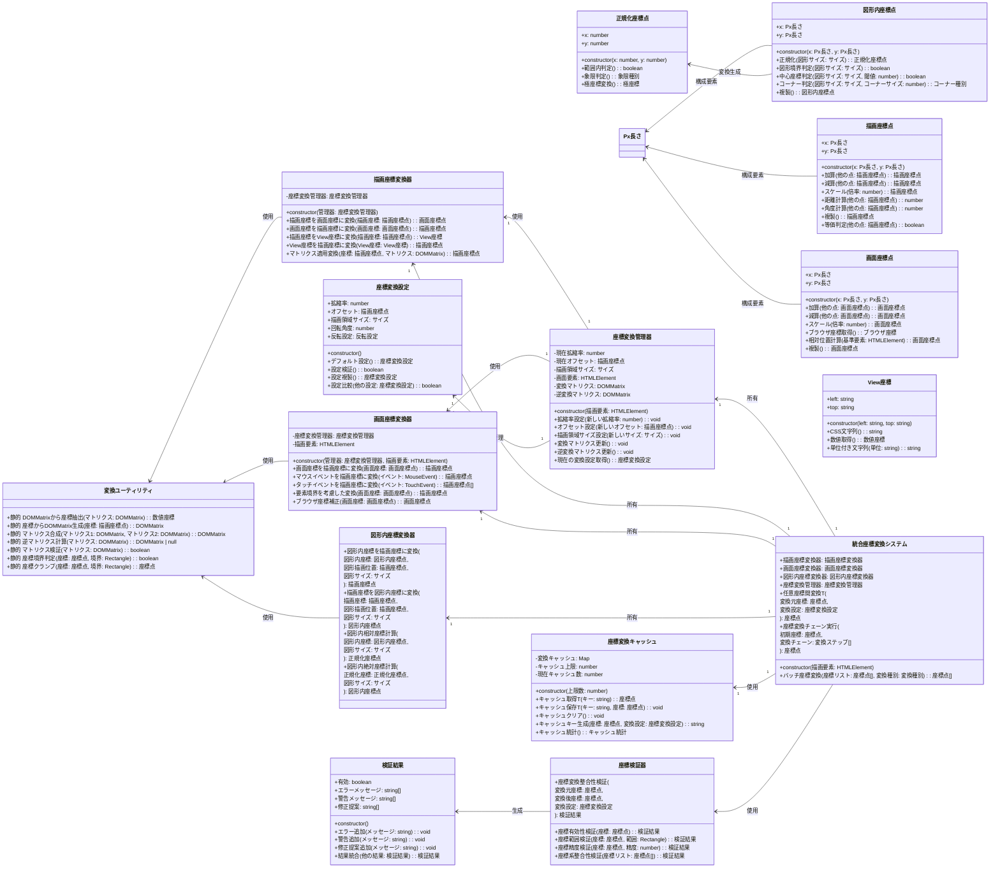
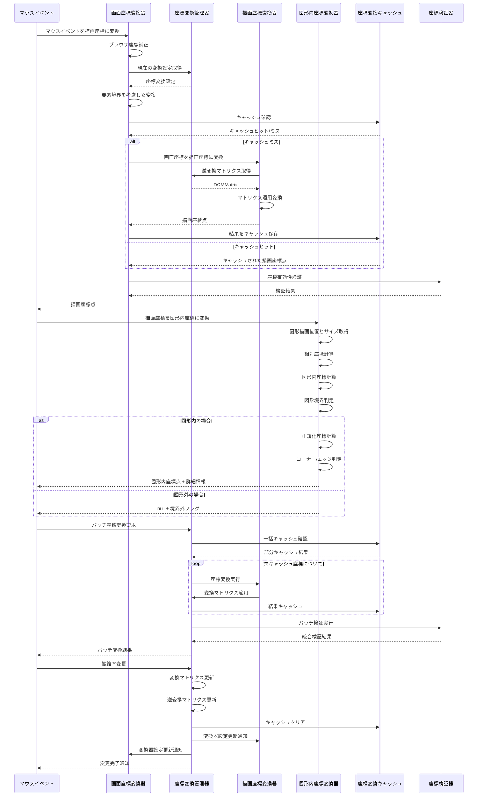

# 07_座標変換システム

実際のコード構造に基づいた、3つの座標系（描画座標・画面座標・図形内座標）間の相互変換システムです。



## 座標変換フロー詳細



## 実装詳細

### 座標変換管理器

```typescript
export class 座標変換管理器 {
    private 現在拡縮率: number = 1.0;
    private 現在オフセット: 描画座標点 = new 描画座標点(new Px長さ(0), new Px長さ(0));
    private 描画領域サイズ: サイズ;
    private 変換マトリクス: DOMMatrix = new DOMMatrix();
    private 逆変換マトリクス: DOMMatrix = new DOMMatrix();

    constructor(private 描画要素: HTMLElement) {
        this.描画領域サイズ = this.要素サイズ取得();
        this.変換マトリクス更新();
        
        // リサイズ監視
        this.リサイズ監視設定();
    }

    public 拡縮率設定(新しい拡縮率: number): void {
        // 拡縮率の範囲制限
        新しい拡縮率 = Math.max(0.1, Math.min(10.0, 新しい拡縮率));
        
        if (this.現在拡縮率 === 新しい拡縮率) return;
        
        this.現在拡縮率 = 新しい拡縮率;
        this.変換マトリクス更新();
    }

    public オフセット設定(新しいオフセット: 描画座標点): void {
        // オフセットの範囲制限（描画領域の10倍まで）
        const 最大オフセット = this.描画領域サイズ.width.値 * 10;
        const クランプされたX = Math.max(-最大オフセット, Math.min(最大オフセット, 新しいオフセット.x.値));
        const クランプされたY = Math.max(-最大オフセット, Math.min(最大オフセット, 新しいオフセット.y.値));
        
        const クランプされたオフセット = new 描画座標点(
            new Px長さ(クランプされたX), 
            new Px長さ(クランプされたY)
        );
        
        if (this.現在オフセット.等価判定(クランプされたオフセット)) return;
        
        this.現在オフセット = クランプされたオフセット;
        this.変換マトリクス更新();
    }

    public 描画領域サイズ設定(新しいサイズ: サイズ): void {
        this.描画領域サイズ = 新しいサイズ;
        this.変換マトリクス更新();
    }

    public 変換マトリクス更新(): void {
        // 変換行列の構築: スケール → 移動
        this.変換マトリクス = new DOMMatrix()
            .scale(this.現在拡縮率, this.現在拡縮率)
            .translate(this.現在オフセット.x.値, this.現在オフセット.y.値);
        
        this.逆変換マトリクス更新();
    }

    public 逆変換マトリクス更新(): void {
        try {
            this.逆変換マトリクス = this.変換マトリクス.inverse();
        } catch (error) {
            console.error('逆変換マトリクス計算エラー:', error);
            // デフォルト値にフォールバック
            this.逆変換マトリクス = new DOMMatrix();
        }
    }

    public 現在の変換設定取得(): 座標変換設定 {
        const 設定 = new 座標変換設定();
        設定.拡縮率 = this.現在拡縮率;
        設定.オフセット = this.現在オフセット.複製();
        設定.描画領域サイズ = this.描画領域サイズ;
        return 設定;
    }

    private 要素サイズ取得(): サイズ {
        const 境界 = this.描画要素.getBoundingClientRect();
        return new サイズ(
            new Px長さ(境界.width),
            new Px長さ(境界.height)
        );
    }

    private リサイズ監視設定(): void {
        const リサイズ監視器 = new ResizeObserver((entries) => {
            for (const entry of entries) {
                const 新しいサイズ = new サイズ(
                    new Px長さ(entry.contentRect.width),
                    new Px長さ(entry.contentRect.height)
                );
                this.描画領域サイズ設定(新しいサイズ);
            }
        });
        
        リサイズ監視器.observe(this.描画要素);
    }
}
```

### 統合座標変換システム

```typescript
export class 統合座標変換システム {
    public readonly 描画座標変換器: 描画座標変換器;
    public readonly 画面座標変換器: 画面座標変換器;
    public readonly 図形内座標変換器: 図形内座標変換器;
    public readonly 座標変換管理器: 座標変換管理器;
    private readonly キャッシュ: 座標変換キャッシュ;
    private readonly 検証器: 座標検証器;

    constructor(描画要素: HTMLElement) {
        this.座標変換管理器 = new 座標変換管理器(描画要素);
        this.描画座標変換器 = new 描画座標変換器(this.座標変換管理器);
        this.画面座標変換器 = new 画面座標変換器(this.座標変換管理器, 描画要素);
        this.図形内座標変換器 = new 図形内座標変換器();
        this.キャッシュ = new 座標変換キャッシュ(1000);
        this.検証器 = new 座標検証器();
    }

    public 任意座標間変換<FROM extends 座標点, TO extends 座標点>(
        変換元座標: FROM,
        変換先種別: 座標種別,
        変換設定?: Partial<座標変換設定>
    ): TO | null {
        try {
            // キャッシュ確認
            const キャッシュキー = this.キャッシュ.キャッシュキー生成(
                変換元座標, 
                変換設定 || this.座標変換管理器.現在の変換設定取得()
            );
            const キャッシュ結果 = this.キャッシュ.キャッシュ取得<TO>(キャッシュキー);
            if (キャッシュ結果) {
                return キャッシュ結果;
            }

            // 座標検証
            const 検証結果 = this.検証器.座標有効性検証(変換元座標);
            if (!検証結果.有効) {
                console.warn('座標変換: 無効な座標です', 検証結果.エラーメッセージ);
                return null;
            }

            // 変換実行
            let 変換結果: TO | null = null;
            
            if (変換元座標 instanceof 描画座標点) {
                switch (変換先種別) {
                    case 座標種別.画面座標:
                        変換結果 = this.描画座標変換器.描画座標を画面座標に変換(変換元座標) as TO;
                        break;
                    case 座標種別.View座標:
                        変換結果 = this.描画座標変換器.描画座標をView座標に変換(変換元座標) as TO;
                        break;
                    default:
                        変換結果 = null;
                }
            } else if (変換元座標 instanceof 画面座標点) {
                switch (変換先種別) {
                    case 座標種別.描画座標:
                        変換結果 = this.画面座標変換器.画面座標を描画座標に変換(変換元座標) as TO;
                        break;
                    default:
                        変換結果 = null;
                }
            }

            // 結果をキャッシュ
            if (変換結果) {
                this.キャッシュ.キャッシュ保存(キャッシュキー, 変換結果);
            }

            return 変換結果;
        } catch (error) {
            console.error('座標変換エラー:', error);
            return null;
        }
    }

    public バッチ座標変換<T extends 座標点>(
        座標リスト: T[], 
        変換先種別: 座標種別,
        変換設定?: Partial<座標変換設定>
    ): (T | null)[] {
        const 結果リスト: (T | null)[] = [];
        
        // バッチキャッシュ確認
        const キャッシュ確認結果 = 座標リスト.map((座標, インデックス) => {
            const キャッシュキー = this.キャッシュ.キャッシュキー生成(
                座標, 
                変換設定 || this.座標変換管理器.現在の変換設定取得()
            );
            const キャッシュ結果 = this.キャッシュ.キャッシュ取得<T>(キャッシュキー);
            return { インデックス, キャッシュキー, 座標, キャッシュ結果 };
        });

        // キャッシュヒットした座標は結果に設定
        for (const 確認結果 of キャッシュ確認結果) {
            if (確認結果.キャッシュ結果) {
                結果リスト[確認結果.インデックス] = 確認結果.キャッシュ結果;
            }
        }

        // キャッシュミスした座標のみ変換実行
        const 変換必要座標 = キャッシュ確認結果.filter(結果 => !結果.キャッシュ結果);
        
        for (const 変換対象 of 変換必要座標) {
            const 変換結果 = this.任意座標間変換(
                変換対象.座標, 
                変換先種別, 
                変換設定
            );
            
            結果リスト[変換対象.インデックス] = 変換結果;
            
            // キャッシュに保存
            if (変換結果) {
                this.キャッシュ.キャッシュ保存(変換対象.キャッシュキー, 変換結果);
            }
        }

        return 結果リスト;
    }

    public 座標変換チェーン実行(
        初期座標: 座標点, 
        変換チェーン: 変換ステップ[]
    ): 座標点 | null {
        let 現在座標: 座標点 | null = 初期座標;
        
        for (const ステップ of 変換チェーン) {
            if (!現在座標) break;
            
            現在座標 = this.任意座標間変換(
                現在座標, 
                ステップ.変換先種別, 
                ステップ.変換設定
            );
            
            if (!現在座標) {
                console.error('座標変換チェーン中断:', ステップ);
                break;
            }
        }
        
        return 現在座標;
    }
}
```

### 画面座標変換器

```typescript
export class 画面座標変換器 {
    constructor(
        private 座標変換管理器: 座標変換管理器,
        private 描画要素: HTMLElement
    ) {}

    public マウスイベントを描画座標に変換(イベント: MouseEvent): 描画座標点 {
        // ブラウザ座標取得
        const ブラウザ座標 = new 画面座標点(
            new Px長さ(イベント.clientX),
            new Px長さ(イベント.clientY)
        );
        
        // 要素内相対座標に変換
        const 要素内座標 = this.要素境界を考慮した変換(ブラウザ座標);
        
        // 描画座標に変換
        return this.画面座標を描画座標に変換(要素内座標);
    }

    public 画面座標を描画座標に変換(画面座標: 画面座標点): 描画座標点 {
        const 変換設定 = this.座標変換管理器.現在の変換設定取得();
        const 逆マトリクス = this.座標変換管理器.逆変換マトリクス;
        
        // DOMPointを使用して逆変換実行
        const 変換前DOMPoint = new DOMPoint(画面座標.x.値, 画面座標.y.値);
        const 変換後DOMPoint = 変換前DOMPoint.matrixTransform(逆マトリクス);
        
        return new 描画座標点(
            new Px長さ(変換後DOMPoint.x),
            new Px長さ(変換後DOMPoint.y)
        );
    }

    public 要素境界を考慮した変換(画面座標: 画面座標点): 画面座標点 {
        const 要素境界 = this.描画要素.getBoundingClientRect();
        
        return new 画面座標点(
            new Px長さ(画面座標.x.値 - 要素境界.left),
            new Px長さ(画面座標.y.値 - 要素境界.top)
        );
    }

    public タッチイベントを描画座標に変換(イベント: TouchEvent): 描画座標点[] {
        const 変換結果: 描画座標点[] = [];
        
        for (let i = 0; i < イベント.touches.length; i++) {
            const タッチ = イベント.touches[i];
            const タッチ座標 = new 画面座標点(
                new Px長さ(タッチ.clientX),
                new Px長さ(タッチ.clientY)
            );
            
            const 描画座標 = this.画面座標を描画座標に変換(タッチ座標);
            変換結果.push(描画座標);
        }
        
        return 変換結果;
    }

    public ブラウザ座標補正(画面座標: 画面座標点): 画面座標点 {
        // ブラウザのスクロール位置を考慮
        const スクロールX = window.pageXOffset || document.documentElement.scrollLeft;
        const スクロールY = window.pageYOffset || document.documentElement.scrollTop;
        
        return new 画面座標点(
            new Px長さ(画面座標.x.値 + スクロールX),
            new Px長さ(画面座標.y.値 + スクロールY)
        );
    }
}
```

### 図形内座標変換器

```typescript
export class 図形内座標変換器 {
    public 図形内座標を描画座標に変換(
        図形内座標: 図形内座標点,
        図形描画位置: 描画座標点,
        図形サイズ: サイズ
    ): 描画座標点 {
        return new 描画座標点(
            new Px長さ(図形描画位置.x.値 + 図形内座標.x.値),
            new Px長さ(図形描画位置.y.値 + 図形内座標.y.値)
        );
    }

    public 描画座標を図形内座標に変換(
        描画座標: 描画座標点,
        図形描画位置: 描画座標点,
        図形サイズ: サイズ
    ): 図形内座標点 {
        const 相対X = 描画座標.x.値 - 図形描画位置.x.値;
        const 相対Y = 描画座標.y.値 - 図形描画位置.y.値;
        
        return new 図形内座標点(
            new Px長さ(相対X),
            new Px長さ(相対Y)
        );
    }

    public 図形内相対座標計算(
        図形内座標: 図形内座標点,
        図形サイズ: サイズ
    ): 正規化座標点 {
        const 正規化X = 図形内座標.x.値 / 図形サイズ.width.値;
        const 正規化Y = 図形内座標.y.値 / 図形サイズ.height.値;
        
        return new 正規化座標点(正規化X, 正規化Y);
    }

    public 図形内絶対座標計算(
        正規化座標: 正規化座標点,
        図形サイズ: サイズ
    ): 図形内座標点 {
        return new 図形内座標点(
            new Px長さ(正規化座標.x * 図形サイズ.width.値),
            new Px長さ(正規化座標.y * 図形サイズ.height.值)
        );
    }
}
```

---
[← 06_状態管理フロー](./06_状態管理フロー.md) | [08_実装ガイド →](./08_実装ガイド.md)