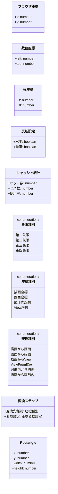

# 09_型定義補完

Mermaid図で使用される型定義の補完です。

```mermaid
classDiagram
    direction RL
    
    %% ========== 基本座標型 ==========
    class ブラウザ座標 {
        +x: number
        +y: number
    }
    
    class 数値座標 {
        +left: number
        +top: number
    }
    
    class 極座標 {
        +r: number
        +θ: number
    }
    
    %% ========== 設定型 ==========
    class 反転設定 {
        +水平: boolean
        +垂直: boolean
    }
    
    class キャッシュ統計 {
        +ヒット数: number
        +ミス数: number
        +使用率: number
    }
    
    %% ========== 列挙型 ==========
    class 象限種別 {
        <<enumeration>>
        第一象限
        第二象限
        第三象限
        第四象限
    }
    
    class 座標種別 {
        <<enumeration>>
        描画座標
        画面座標
        図形内座標
        View座標
    }
    
    class 変換種別 {
        <<enumeration>>
        描画から画面
        画面から描画
        描画からView
        ViewFrom描画
        図形内から描画
        描画から図形内
    }
    
    %% ========== 変換設定 ==========
    class 変換ステップ {
        +変換先種別: 座標種別
        +変換設定: 座標変換設定
    }
    
    class Rectangle {
        +x: number
        +y: number
        +width: number
        +height: number
    }
```

---
[← 08_実装ガイド](./08_実装ガイド.md) | [README →](./README.md)