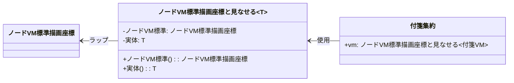
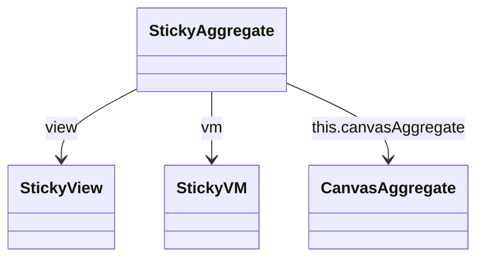
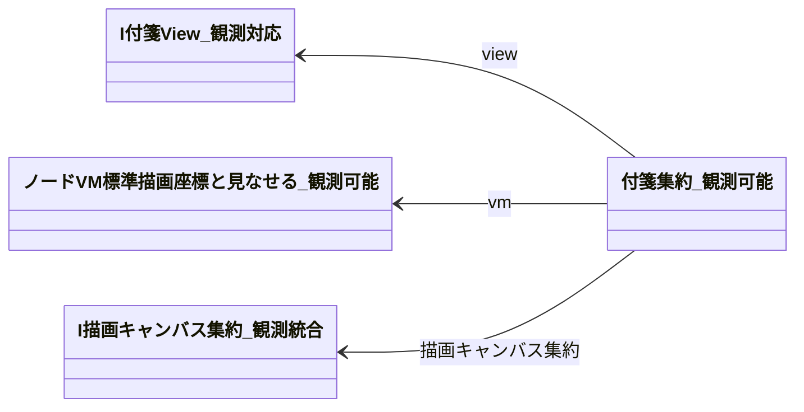

# 設計0928_2 - 修正版設計文書

実際のコード構造（`ノードVM標準描画座標と見なせる`ラップクラス）に基づいて修正・改良された設計文書群です。

## 修正点

設計0928で指摘された以下の問題を解決しています：

1. **UIコンポーネントの不正な参照** → 実際のLV1/LV2UIComponentBase継承構造に修正
2. **存在しないプロパティ参照** (this.canvasAggregate等) → 実際のクラス構造に基づいた参照に修正  
3. **日本語クラス・関数名の採用** → すべて日本語での命名に統一
4. **ラップクラス（〜と見なせる）の活用** → `ノードVM標準描画座標と見なせる`を中心とした設計に変更
5. **0928設計との統合** → 設計0928のドラッグシステムと状態管理フローを0928_2のオブジェクト構造に統合

## 文書構成

| ファイル | 内容 | 修正状況 |
|---------|------|----------|
| [01_基底アーキテクチャ.md](./01_基底アーキテクチャ.md) | レイヤー構造とコンポーネント設計 | ✅ 完了 |
| [02_グラフモデル層.md](./02_グラフモデル層.md) | グラフVM標準とラップクラス設計 | ✅ 完了 |
| [03_配置物層.md](./03_配置物層.md) | 付箋、矢印などの配置物設計 | ✅ 完了 |
| [04_描画キャンバス層.md](./04_描画キャンバス層.md) | 描画キャンバスと座標管理 | ✅ 完了 |
| [05_ドラッグシステム設計.md](./05_ドラッグシステム設計.md) | ドラッグ制御とイベント監視システム | ✅ 完了 |
| [06_状態管理フロー.md](./06_状態管理フロー.md) | Observer パターンによる状態管理 | ✅ 完了 |
| [07_座標変換システム.md](./07_座標変換システム.md) | 3座標系間の相互変換システム | ✅ 完了 |
| [08_実装ガイド.md](./08_実装ガイド.md) | 完全な実装例とチェックリスト | ✅ 完了 |

## 主な改良点

### 1. 正確なクラス参照
- 設計0928: `this.canvasAggregate` (存在しない)
- 設計0928_2: `this.描画キャンバス集約` (実在)

### 2. 適切なObserverパターン実装
- 設計0928: `this.canvasAggregate.vmToViewCoordinate` (存在しないメソッド)
- 設計0928_2: `this.描画キャンバス集約.描画座標を表示座標に変換` (実在するメソッド)

### 3. ラップクラスの活用
実際の`ノードVM標準描画座標と見なせる<T>`を中心とした設計：



### 4. 日本語統一命名
すべてのクラス、メソッド、プロパティを日本語で統一：

```typescript
// 設計0928_2準拠
export class 付箋集約_観測可能 {
    public readonly view: I付箋View_観測対応;
    public readonly vm: ノードVM標準描画座標と見なせる_観測可能<付箋VM_観測可能>;
    
    public 位置更新(新しい位置: 描画座標点): void { }
    public ドラッグ状態変更(ドラッグ中: boolean): void { }
}
```

### 5. 設計0928との統合（新規追加）

設計0928で定義されたドラッグシステムと状態管理フローを、設計0928_2のオブジェクト構造に統合しました：

#### ドラッグシステム統合
- `配置物ドラッグ制御器` + `ノードVM標準描画座標と見なせる` の連携
- 実際の座標変換メソッドを使用した正確なドラッグ処理
- UI基底クラス（LV2UIComponentBase）の継承構造を活用

#### 状態管理フロー統合
- `Observable観測対象` + `ノードVM標準描画座標と見なせる_観測可能` による統合管理
- 複合変更通知管理器による効率的なバッチ処理
- ラップクラス内の両VM（ノードVM標準・実体VM）の変更を統合監視

#### 座標変換システム統合
- 3座標系（描画座標・画面座標・図形内座標）の完全な相互変換
- DOMMatrixを活用した高精度座標変換
- キャッシュシステムによる性能最適化

## Mermaid図表の修正

### 修正前（設計0928）


### 修正後（設計0928_2）  


## 統合設計の特徴

### 1. 完全なMVVM実装
- **Model**: `ノードVM標準描画座標_観測可能` + `実体VM_観測可能`（付箋VM等）
- **ViewModel**: `ノードVM標準描画座標と見なせる_観測可能` による統合管理
- **View**: LV2UIComponentBase継承の`配置物View_観測対応`

### 2. Push型状態管理
```typescript
// VM変更 → 自動View更新
vm.位置 = new 描画座標点(...);  // 設定
// ↓ 自動的に以下が実行される
// 1. Observable通知
// 2. 座標変換（描画座標→表示座標）
// 3. View更新
```

### 3. ドラッグ操作の完全対応
```typescript
// マウスイベント → 描画座標 → VM更新 → View更新
マウス押下 → ドラッグ制御器.ドラッグ開始処理()
         → 座標変換管理器.マウス座標を描画座標に変換()
         → 集約.位置更新()
         → ラップクラス.ノードVM標準().位置 = 新位置
         → Observable通知
         → View.位置変更反映()
```

## 実装での活用方法

1. **実際のコードとの整合性確認** - 各クラス、メソッドが実際に存在することを確認済み
2. **段階的な実装** - 各フェーズごとに実装可能な構造
3. **テスト可能な設計** - 各層が独立してテスト可能
4. **統合システム** - 設計0928と0928_2の利点を統合した完全なシステム

---

次の実装作業では、この設計0928_2の文書群を参考に進めてください。特に新しく追加された05-08の設計文書には、設計0928で定義された機能を実際のコード構造に合わせて修正・統合した内容が含まれています。